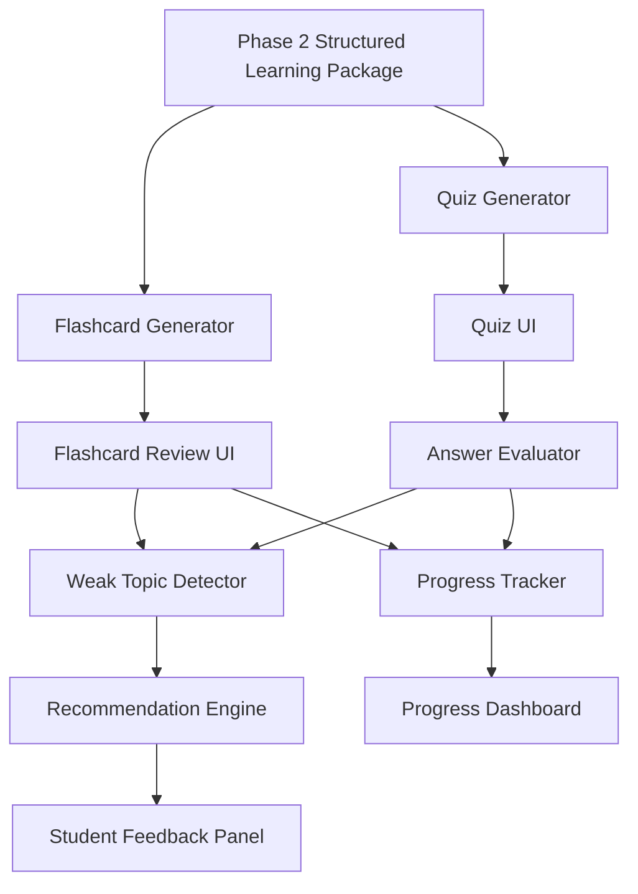

# Phase 3: Interactive Learning Module

> **Project:** StudyPilot AI  
> **Phase:** 3 of N - Interactive Learning Module  
> **Status:** Implementation-Ready  
> **Author:** StudyPilot AI Development Team  
> **Last Updated:** June 2026

---

## Table of Contents

1. [Objective](#objective)
2. [Features](#features)
3. [User Flow](#user-flow)
4. [Inputs](#inputs)
5. [Outputs](#outputs)
6. [Components](#components)
7. [Learning Experience Design](#learning-experience-design)
8. [Technical Architecture](#technical-architecture)
9. [API Design](#api-design)
10. [Data Structures](#data-structures)
11. [Libraries and Dependencies](#libraries-and-dependencies)
12. [Folder Structure](#folder-structure)
13. [Implementation Steps](#implementation-steps)
14. [Performance Optimization](#performance-optimization)
15. [Edge Cases](#edge-cases)
16. [Testing Checklist](#testing-checklist)
17. [Completion Criteria](#completion-criteria)

---

## Objective

Phase 3 converts the **Structured Learning Package** produced by Phase 2 into practical, interactive study tools that help students revise, test themselves, and identify what they still need to learn.

Where Phase 2 focuses on understanding the uploaded material, Phase 3 focuses on **active learning**. It takes summaries, key concepts, topic hierarchies, and metadata, then generates flashcards, quizzes, revision tasks, and study recommendations. The goal is to move the student from passive reading to measurable practice.

By the end of this phase, a student should be able to open StudyPilot AI after uploading study material and immediately begin reviewing flashcards, answering quiz questions, checking weak areas, and following a suggested study path. Phase 3 becomes the first major user-facing learning layer of the product.

---

## Features

### Flashcard Generator

Creates revision flashcards from the key concepts, definitions, and topic hierarchy generated in Phase 2.

**Requirements:**
- Generate question-answer style flashcards from important concepts
- Support definition, comparison, example, and application-based cards
- Group flashcards by topic
- Include difficulty level for each card: `easy`, `medium`, or `hard`
- Avoid duplicate cards that test the same fact in nearly identical wording
- Store cards in a structure suitable for review sessions

---

### Quiz Generator

Creates topic-aware quizzes that allow students to test their understanding of the uploaded material.

**Requirements:**
- Generate multiple-choice questions from summaries, concepts, and topics
- Provide four answer options per question
- Mark one correct option clearly
- Include a short explanation for the correct answer
- Assign each question to a topic and difficulty level
- Support configurable quiz length based on available content

---

### Answer Evaluation Engine

Evaluates student answers and calculates quiz performance.

**Requirements:**
- Compare selected answers against the correct answer key
- Calculate total score and percentage
- Track correct and incorrect questions
- Group mistakes by topic
- Produce a short performance summary after quiz completion
- Prepare weak topic data for future study planning

---

### Weak Topic Detector

Identifies topics where the student is struggling based on quiz results and flashcard review activity.

**Requirements:**
- Detect topics with repeated incorrect quiz answers
- Detect flashcards marked as difficult or not remembered
- Rank weak topics by severity
- Include recommended next actions for each weak topic
- Output data in a format that can be consumed by the Study Planner

---

### Study Recommendation Engine

Generates practical study recommendations using the student's weak topics, content complexity, and estimated study time.

**Requirements:**
- Suggest which topics to revise first
- Recommend whether the student should review summaries, flashcards, or quizzes
- Prioritize high-relevance topics from Phase 2
- Use difficulty and score data to adjust recommendations
- Produce clear, student-friendly advice

---

### Progress Tracker

Tracks the student's interaction with generated learning tools.

**Requirements:**
- Track completed flashcards
- Track quiz attempts and scores
- Track weak topics over time within the current study session
- Store simple session-level progress data
- Display progress in the Streamlit UI using metrics or charts

---

## User Flow

```text
1.  Structured Learning Package received from Phase 2
        |
2.  Flashcard Generator creates topic-grouped flashcards
        |
3.  Quiz Generator creates question sets from the same content
        |
4.  Student reviews flashcards in the StudyPilot UI
        |
5.  Student attempts a quiz
        |
6.  Answer Evaluation Engine grades the quiz
        |
7.  Weak Topic Detector identifies areas needing revision
        |
8.  Study Recommendation Engine suggests next actions
        |
9.  Progress Tracker updates session progress
        |
10. Results are displayed to the student for continued study
```

---

## Inputs

| Input | Type | Description |
|---|---|---|
| Structured Learning Package | `dict` | Unified output from Phase 2 containing summaries, concepts, topics, hierarchy, and metadata |
| Quiz Length | `int` | Optional number of quiz questions requested by the user |
| Student Answers | `list[dict]` | Selected answers submitted by the student during a quiz attempt |
| Flashcard Feedback | `list[dict]` | Student review feedback such as remembered, unsure, or forgot |

---

## Outputs

| Output | Type | Description |
|---|---|---|
| Flashcards | `list[dict]` | Generated revision cards grouped by topic and difficulty |
| Quiz Questions | `list[dict]` | Multiple-choice questions with options, correct answer, topic, and explanation |
| Quiz Result | `dict` | Score, percentage, correct answers, incorrect answers, and topic-level breakdown |
| Weak Topics | `list[dict]` | Ranked list of topics where the student needs more practice |
| Study Recommendations | `list[str]` | Personalized revision suggestions based on performance |
| Progress Summary | `dict` | Session-level progress data for the UI |

---

## Components

### Flashcard Generator

**Suggested file:** `modules/flashcard_generator.py`

Responsible for creating high-quality flashcards from concepts, definitions, summaries, and topic hierarchy data.

**Responsibilities:**
- Read key concepts and related summary sections
- Generate clear question-answer pairs
- Attach topic, difficulty, and source concept metadata
- Deduplicate similar cards
- Return flashcards as a list of dictionaries

---

### Quiz Generator

**Suggested file:** `modules/quiz_generator.py`

Responsible for generating multiple-choice questions that test both recall and understanding.

**Responsibilities:**
- Select important topics and concepts for quiz coverage
- Generate question text, answer options, correct answer, and explanation
- Balance difficulty across the quiz
- Avoid questions with ambiguous or overlapping options
- Return quiz questions in a UI-ready structure

---

### Answer Evaluator

**Suggested file:** `modules/answer_evaluator.py`

Responsible for grading quiz attempts and producing performance analytics.

**Responsibilities:**
- Accept quiz questions and submitted answers
- Compare student selections with correct answers
- Calculate score and percentage
- Group incorrect answers by topic
- Return a structured quiz result object

---

### Weak Topic Detector

**Suggested file:** `modules/weak_topic_detector.py`

Responsible for identifying the topics that need the most revision.

**Responsibilities:**
- Analyze incorrect quiz answers
- Analyze flashcard feedback
- Rank weak topics by mistake frequency and topic importance
- Assign severity levels: `low`, `medium`, or `high`
- Return weak topic records for recommendations and future planning

---

### Recommendation Engine

**Suggested file:** `modules/recommendation_engine.py`

Responsible for turning performance data into practical next steps for the student.

**Responsibilities:**
- Use weak topics, quiz scores, and metadata to prioritize study actions
- Recommend review mode: summary, flashcards, quiz retry, or focused revision
- Generate short, actionable suggestions
- Avoid generic advice when topic-specific data is available

---

### Progress Tracker

**Suggested file:** `modules/progress_tracker.py`

Responsible for maintaining session-level learning progress.

**Responsibilities:**
- Track quiz attempts and latest score
- Track completed flashcards
- Track current weak topics
- Calculate completion percentage for each learning activity
- Provide progress data to the Streamlit interface

---

## Learning Experience Design

Phase 3 should encourage active recall instead of passive reading. Every feature must either ask the student to retrieve knowledge, apply a concept, or make a decision about their confidence.

**Design principles:**
- Keep questions concise and unambiguous
- Prefer student-friendly language over academic wording
- Show explanations immediately after quiz submission
- Use weak topic feedback to guide the next action
- Avoid overwhelming the student with too many generated items at once
- Make progress visible so the student feels momentum

**Recommended review loop:**

```text
Read summary -> Review flashcards -> Take quiz -> Check weak topics -> Revise -> Retry quiz
```

---

## Technical Architecture

### Architecture Overview

Phase 3 sits directly after the AI Processing Engine and before future advanced modules such as full study planning, exam readiness scoring, mind map visualization, and AI doubt solving.

```text
Phase 1: Input Module
        |
        v
Phase 2: AI Processing Engine
        |
        v
Phase 3: Interactive Learning Module
        |
        v
Future Phases: Study Planner, Mind Map, Doubt Solver, Exam Readiness
```

### Mermaid Diagram



**Frontend:** Built in Streamlit using tabs or sections for Flashcards, Quiz, Weak Topics, and Progress. The interface should allow the student to move between tools without re-uploading content.

**Backend:** Each learning tool should be implemented as a focused Python module. Generated flashcards and quizzes can initially be stored in `st.session_state` for the MVP, then migrated to a persistent database in a later phase.

---

## API Design

### `generate_flashcards(learning_package: dict) -> list[dict]`

Generates flashcards from the structured content produced by Phase 2.

**Request:**

```python
flashcards = generate_flashcards(learning_package)
```

**Response:**

```python
[
    {
        "id": "fc_001",
        "topic": "Database Joins",
        "question": "What is the purpose of an INNER JOIN?",
        "answer": "An INNER JOIN returns only rows that have matching values in both tables.",
        "difficulty": "medium",
        "source_concept": "Inner Join"
    }
]
```

---

### `generate_quiz(learning_package: dict, question_count: int = 10) -> list[dict]`

Generates a multiple-choice quiz from the structured learning package.

**Request:**

```python
quiz = generate_quiz(learning_package, question_count=10)
```

**Response:**

```python
[
    {
        "id": "q_001",
        "topic": "Transactions",
        "question": "Which ACID property ensures that a transaction is completed fully or not at all?",
        "options": ["Atomicity", "Isolation", "Durability", "Consistency"],
        "correct_answer": "Atomicity",
        "explanation": "Atomicity means a transaction is treated as one complete unit.",
        "difficulty": "medium"
    }
]
```

---

### `evaluate_quiz(quiz: list[dict], student_answers: list[dict]) -> dict`

Grades submitted quiz answers and returns performance data.

**Request:**

```python
result = evaluate_quiz(quiz, student_answers)
```

**Response:**

```python
{
    "score": 8,
    "total": 10,
    "percentage": 80,
    "correct_question_ids": ["q_001", "q_002"],
    "incorrect_question_ids": ["q_006", "q_009"],
    "topic_breakdown": {
        "Transactions": {"correct": 2, "incorrect": 1},
        "Joins": {"correct": 3, "incorrect": 0}
    }
}
```

---

### `detect_weak_topics(quiz_result: dict, flashcard_feedback: list[dict]) -> list[dict]`

Detects weak topics from quiz mistakes and flashcard review feedback.

**Request:**

```python
weak_topics = detect_weak_topics(quiz_result, flashcard_feedback)
```

**Response:**

```python
[
    {
        "topic": "Transactions",
        "severity": "high",
        "reason": "Multiple incorrect answers and low flashcard confidence",
        "recommended_action": "Review transaction properties, then retry a focused quiz."
    }
]
```

---

### `generate_recommendations(weak_topics: list[dict], metadata: dict) -> list[str]`

Creates personalized study recommendations.

**Request:**

```python
recommendations = generate_recommendations(weak_topics, metadata)
```

**Response:**

```python
[
    "Revise Transactions first because it has high difficulty and repeated mistakes.",
    "Review flashcards for ACID properties before attempting another quiz.",
    "Spend at least 25 minutes on weak topics before moving to new material."
]
```

---

## Data Structures

### Flashcard Object

```json
{
  "id": "fc_001",
  "topic": "Database Joins",
  "question": "What is an INNER JOIN?",
  "answer": "An INNER JOIN returns records that have matching values in both tables.",
  "difficulty": "medium",
  "source_concept": "Inner Join",
  "review_status": "not_started"
}
```

### Quiz Question Object

```json
{
  "id": "q_001",
  "topic": "Transactions",
  "question": "Which ACID property prevents partial transaction completion?",
  "options": ["Atomicity", "Isolation", "Durability", "Consistency"],
  "correct_answer": "Atomicity",
  "explanation": "Atomicity ensures all operations in a transaction succeed or all fail.",
  "difficulty": "medium"
}
```

### Quiz Result Object

```json
{
  "score": 8,
  "total": 10,
  "percentage": 80,
  "topic_breakdown": {
    "Transactions": {
      "correct": 2,
      "incorrect": 1
    }
  },
  "completed_at": "2026-06-17T19:30:00"
}
```

### Weak Topic Object

```json
{
  "topic": "Transactions",
  "severity": "high",
  "mistake_count": 3,
  "confidence_score": 0.42,
  "recommended_action": "Review the detailed summary and retry transaction flashcards."
}
```

---

## Libraries and Dependencies

| Library | Purpose |
|---|---|
| `streamlit` | User interface for flashcards, quizzes, progress, and recommendations |
| `groq` | Optional LLM-based generation for flashcards and quizzes |
| `pydantic` | Validation of generated flashcard, quiz, and result objects |
| `pandas` | Progress and topic breakdown tables |
| `plotly` | Optional progress charts and score visualization |
| `python-dotenv` | Loading environment variables for API keys |

---

## Folder Structure

```text
StudyPilot/
│
├── app.py
├── modules/
│   ├── flashcard_generator.py
│   ├── quiz_generator.py
│   ├── answer_evaluator.py
│   ├── weak_topic_detector.py
│   ├── recommendation_engine.py
│   └── progress_tracker.py
│
├── prompts/
│   ├── flashcard_prompt.txt
│   └── quiz_prompt.txt
│
├── tests/
│   ├── test_flashcard_generator.py
│   ├── test_quiz_generator.py
│   ├── test_answer_evaluator.py
│   └── test_weak_topic_detector.py
│
└── requirements.txt
```

---

## Implementation Steps

1. Define the flashcard, quiz question, quiz result, and weak topic schemas
2. Build the Flashcard Generator using Phase 2 concepts and summaries
3. Build the Quiz Generator with multiple-choice question output
4. Implement answer evaluation and topic-level scoring
5. Implement weak topic detection from quiz and flashcard activity
6. Implement recommendation generation from weak topics and metadata
7. Add Streamlit UI tabs for Flashcards, Quiz, Weak Topics, and Progress
8. Store generated learning data in `st.session_state`
9. Add validation for malformed or incomplete generated content
10. Write unit tests for core scoring and weak topic logic

---

## Performance Optimization

- Generate flashcards and quiz questions once per uploaded content package
- Cache generated outputs using `st.session_state`
- Limit initial quiz generation to 10 questions for MVP
- Generate additional questions only when the user requests them
- Reuse Phase 2 structured data instead of sending raw content back to the LLM unnecessarily
- Keep answer evaluation deterministic and local

---

## Edge Cases

| Edge Case | Expected Handling |
|---|---|
| Too few concepts to generate a full quiz | Generate fewer questions and show a clear message |
| Duplicate flashcards generated | Deduplicate by normalized question and answer text |
| Ambiguous multiple-choice options | Regenerate or reject the question during validation |
| Student exits quiz early | Preserve partial answers in session state |
| Missing topic labels | Assign item to `General` topic |
| No incorrect answers | Show positive feedback and recommend advanced review |
| All answers incorrect | Recommend summary review before quiz retry |
| Empty Phase 2 package | Stop generation and show an error message |

---

## Testing Checklist

### Flashcards

- [ ] Flashcards are generated from valid Phase 2 output
- [ ] Each flashcard has a question, answer, topic, and difficulty
- [ ] Duplicate flashcards are removed
- [ ] Flashcards are grouped by topic
- [ ] Empty or incomplete input is handled gracefully

### Quiz

- [ ] Quiz questions contain exactly four options
- [ ] Each question has one correct answer
- [ ] Correct answer exists in the options list
- [ ] Explanations are present and relevant
- [ ] Requested quiz length is respected when enough content exists

### Evaluation

- [ ] Correct answers increase the score
- [ ] Incorrect answers are tracked by question ID
- [ ] Percentage calculation is accurate
- [ ] Topic breakdown matches submitted answers
- [ ] Missing answers are counted as incorrect

### Weak Topic Detection

- [ ] Incorrect quiz answers create weak topic signals
- [ ] Flashcard feedback affects weak topic severity
- [ ] Weak topics are ranked by severity
- [ ] Recommendations reference actual topics from the content

### UI

- [ ] Flashcards can be reviewed one by one
- [ ] Quiz can be submitted from the UI
- [ ] Results display score and topic breakdown
- [ ] Weak topic panel updates after quiz completion
- [ ] Progress metrics update during the session

---

## Completion Criteria

Phase 3 is complete when:

- Structured Phase 2 output can be converted into flashcards
- Structured Phase 2 output can be converted into a quiz
- Students can submit quiz answers and receive a score
- Incorrect answers are grouped by topic
- Weak topics are detected from quiz and flashcard activity
- Study recommendations are generated from weak topic data
- Progress is visible in the Streamlit UI
- Core logic is covered by tests
- The module handles incomplete or low-quality input without crashing

---

## MVP Scope

For the first working version, Phase 3 should include:

- Flashcard generation
- Multiple-choice quiz generation
- Quiz scoring
- Weak topic detection
- Basic recommendations
- Streamlit UI integration
- Session-based progress tracking

Persistent accounts, long-term history, spaced repetition scheduling, exam readiness scoring, and full study plan generation should be handled in later phases.