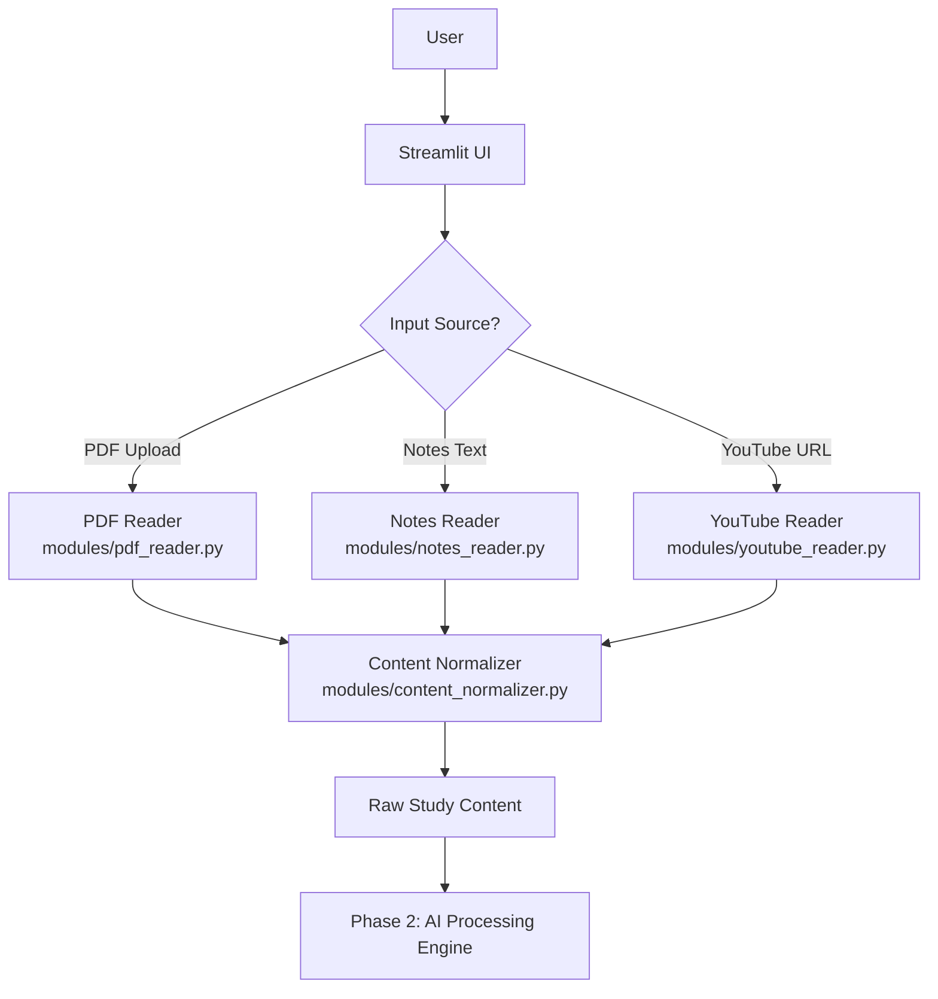

# Phase 1: Input Module

**Project:** StudyPilot AI  
**Phase:** 1 of N  
**Status:** In Development  
**Last Updated:** June 2026

---

## Objective

The Input Module is the entry point of the StudyPilot AI pipeline. Its purpose is to accept raw study material from multiple real-world sources — PDF documents, manually written notes, and YouTube lecture videos — and convert all of them into a single, clean, normalized text string called **Raw Study Content**.

This unified output is critical because every downstream AI feature (summaries, flashcards, quizzes, weak topic analysis, study plans, exam readiness scores, and doubt solving) depends on receiving consistent, well-formed text. Without a reliable Input Module, the AI Processing Engine cannot operate predictably across different input types.

The module abstracts away the complexity of each source format so that Phase 2 always receives the same data structure, regardless of whether the user uploaded a 50-page textbook PDF or pasted three lines of personal notes.

---

## Features

### PDF Upload

Allows users to upload lecture notes, textbook chapters, or printed handouts in PDF format.

**Requirements:**
- Accept `.pdf` file uploads via the Streamlit UI
- Extract all readable text using `PyPDF2`
- Handle multi-page documents by iterating over all pages
- Skip embedded images (not extracted in MVP)
- Return extracted text as a single concatenated string

---

### Notes Input

Allows users to directly paste or type their study notes into a text area.

**Requirements:**
- Multi-line text area with a placeholder prompt
- Live character counter displayed below the input field
- Validation to reject empty or whitespace-only submissions
- Accepts plain text; no Markdown or HTML parsing required in MVP

---

### YouTube Lecture Input

Allows users to paste a YouTube video URL to extract its auto-generated or manual transcript.

**Requirements:**
- Validate that the input is a properly formatted YouTube URL
- Extract the video transcript using `youtube-transcript-api`
- Merge all transcript segments into a single continuous text block
- Handle videos with no available transcript gracefully with a user-facing error message

---

## User Flow

1. The user opens the StudyPilot AI web app
2. The user selects an input source from the sidebar: **PDF**, **Notes**, or **YouTube URL**
3. Based on the selected source:
   - PDF: user uploads a `.pdf` file
   - Notes: user types or pastes text into the text area
   - YouTube: user pastes a YouTube video link
4. The user clicks the **Process** button
5. The system routes the input to the appropriate reader module
6. The reader extracts raw text from the source
7. The Content Normalizer cleans and standardizes the extracted text
8. The system combines all content into the **Raw Study Content** string
9. Raw Study Content is passed to the AI Processing Engine (Phase 2)

---

## Inputs

| Input | Type | Description |
|---|---|---|
| PDF File | `UploadedFile` (Streamlit) | A `.pdf` document uploaded by the user containing lecture notes or textbook content |
| Notes Text | `str` | Raw text entered or pasted by the user directly into the text area |
| YouTube URL | `str` | A valid YouTube video URL whose transcript will be fetched and extracted |

---

## Outputs

| Output | Type | Description |
|---|---|---|
| Raw Study Content | `str` | A single normalized text string combining all extracted content, ready for the AI Processing Engine |

---

## Components

### PDF Reader Module

**File:** `modules/pdf_reader.py`

**Responsibilities:**
- Accept a Streamlit `UploadedFile` object
- Open and parse the PDF using `PyPDF2.PdfReader`
- Iterate over all pages and extract text from each
- Concatenate all page text into a single string
- Return the raw extracted string to the caller

**Notes:**  
For MVP, images, tables, and figures embedded in PDFs are ignored. Only machine-readable text layers are extracted. Scanned PDFs without OCR text will return empty content and trigger an error message.

---

### Notes Reader Module

**File:** `modules/notes_reader.py`

**Responsibilities:**
- Accept a raw string from the Streamlit text area
- Validate that the input is non-empty and not purely whitespace
- Apply basic cleaning (strip leading/trailing whitespace)
- Return the cleaned string

**Notes:**  
This is the simplest module in Phase 1. No parsing libraries are required. Validation is the primary concern.

---

### YouTube Reader Module

**File:** `modules/youtube_reader.py`

**Responsibilities:**
- Accept a YouTube URL string from the user
- Validate the URL format using regex
- Extract the video ID from the URL
- Fetch the transcript using `YouTubeTranscriptApi.get_transcript(video_id)`
- Merge all transcript segment dictionaries into a single text string
- Return the merged transcript

**Notes:**  
Transcripts are returned by the API as a list of dicts: `[{"text": "...", "start": 0.0, "duration": 1.5}, ...]`. Only the `"text"` field is used.

---

### Content Normalizer

**File:** `modules/content_normalizer.py`

**Responsibilities:**
- Remove excessive whitespace (collapse multiple spaces into one)
- Remove duplicate or excessive blank lines
- Strip non-printable or control characters
- Standardize line endings to `\n`
- Return the final cleaned string

**Notes:**  
The normalizer is applied to all content after extraction, regardless of source. It ensures that the Raw Study Content passed to Phase 2 is always in a predictable, clean format.

---

## Technical Architecture



**Frontend:** Built with Streamlit. The UI renders a sidebar for source selection and dynamically shows the appropriate input widget (file uploader, text area, or URL field) based on the user's choice.

**Backend:** Each reader module is a standalone Python function. The `app.py` entry point calls the appropriate reader based on the selected source, then passes the result to the Content Normalizer before forwarding to Phase 2.

---

## API Design

### `extract_pdf_text(uploaded_file) -> str`

Extracts text from an uploaded PDF file.

**Request:**
```python
uploaded_file  # Streamlit UploadedFile object
```

**Response:**
```python
"Chapter 1: Introduction to Databases\nA database is an organized collection of structured..."
```

---

### `extract_notes_text(raw_text: str) -> str`

Validates and returns cleaned notes input.

**Request:**
```python
raw_text = "Normalization reduces redundancy. 1NF requires atomic values."
```

**Response:**
```python
"Normalization reduces redundancy. 1NF requires atomic values."
```

---

### `extract_youtube_transcript(url: str) -> str`

Extracts and merges the transcript from a YouTube video.

**Request:**
```python
url = "https://www.youtube.com/watch?v=dQw4w9WgXcQ"
```

**Response:**
```python
"Welcome to this lecture on database normalization. Today we will cover first second and third normal form..."
```

---

### `normalize_text(raw_text: str) -> str`

Cleans and standardizes any extracted text string.

**Request:**
```python
raw_text = "  Chapter 1   \n\n\n  Introduction  \n  "
```

**Response:**
```python
"Chapter 1\nIntroduction"
```

---

## Data Structures

**PDF Source Payload:**
```json
{
  "source_type": "pdf",
  "file_name": "db_notes.pdf",
  "page_count": 12,
  "content": "Chapter 1: Introduction to Databases. A database is an organized..."
}
```

**Notes Source Payload:**
```json
{
  "source_type": "notes",
  "character_count": 342,
  "content": "Normalization reduces redundancy. 1NF requires atomic values..."
}
```

**YouTube Source Payload:**
```json
{
  "source_type": "youtube",
  "video_url": "https://www.youtube.com/watch?v=abc123",
  "video_id": "abc123",
  "segment_count": 87,
  "transcript": "Welcome to this lecture on database normalization..."
}
```

**Normalized Output Passed to Phase 2:**
```json
{
  "raw_study_content": "Chapter 1 Introduction to Databases A database is an organized collection...",
  "source_type": "pdf",
  "timestamp": "2026-06-17T10:30:00Z"
}
```

---

## Libraries and Dependencies

| Library | Version | Purpose |
|---|---|---|
| `streamlit` | ≥1.30 | Frontend UI framework for file uploaders, text areas, and buttons |
| `PyPDF2` | ≥3.0 | PDF parsing and text extraction from uploaded documents |
| `youtube-transcript-api` | ≥0.6 | Fetches auto-generated and manual transcripts from YouTube videos |
| `re` | stdlib | Regular expressions for URL validation and text cleaning |
| `typing` | stdlib | Type hints for function signatures to improve code readability |

**Install all dependencies:**
```bash
pip install streamlit PyPDF2 youtube-transcript-api
```

---

## Folder Structure

```
StudyPilotAI/
│
├── app.py                        # Main Streamlit entry point
│
├── modules/
│   ├── pdf_reader.py             # PDF upload and text extraction
│   ├── notes_reader.py           # Notes text input and validation
│   ├── youtube_reader.py         # YouTube URL validation and transcript fetch
│   └── content_normalizer.py     # Text cleaning and standardization
│
├── requirements.txt              # Phase 1 dependencies
└── README.md
```

---

## UI Design

The Streamlit interface for Phase 1 is organized as follows:

**Sidebar:**
- App title and logo
- Radio button group: `Select Input Source` — options: PDF Upload, Paste Notes, YouTube URL

**Main Panel (dynamic, based on sidebar selection):**

- **PDF Upload view:** `st.file_uploader("Upload your PDF", type=["pdf"])` with a note about supported file types
- **Notes view:** `st.text_area("Paste your notes here", height=300)` with a live character counter rendered below using `st.caption(f"{len(text)} characters")`
- **YouTube URL view:** `st.text_input("Enter YouTube lecture URL")` with an example URL shown as placeholder text

**Shared Elements:**
- `st.button("Process Content")` — primary action button, full-width, shown in all views
- `st.spinner("Extracting content...")` — shown during processing
- `st.success("Content ready!")` or `st.error("...")` — shown after processing completes

---

## Implementation Steps

1. **Set up the project folder** — Create `StudyPilotAI/` with `app.py`, `modules/`, and `requirements.txt`
2. **Install dependencies** — Run `pip install streamlit PyPDF2 youtube-transcript-api`
3. **Build the Streamlit sidebar** — Add the app title and radio button for source selection
4. **Implement `pdf_reader.py`** — Write `extract_pdf_text()` using `PyPDF2.PdfReader` to loop over pages and concatenate text
5. **Integrate PDF uploader in `app.py`** — Add `st.file_uploader` and call `extract_pdf_text()` on upload
6. **Implement `notes_reader.py`** — Write `extract_notes_text()` with empty-input validation and strip cleaning
7. **Integrate notes text area in `app.py`** — Add `st.text_area` with character counter and validation feedback
8. **Implement `youtube_reader.py`** — Write URL regex validator and `extract_youtube_transcript()` using `YouTubeTranscriptApi`
9. **Integrate YouTube URL input in `app.py`** — Add `st.text_input` and call `extract_youtube_transcript()` on submit
10. **Implement `content_normalizer.py`** — Write `normalize_text()` to remove extra spaces, collapse blank lines, and strip control characters
11. **Wire up the normalization step** — After each reader returns text, pass the result through `normalize_text()` before storing
12. **Assemble the Raw Study Content payload** — Build the output JSON/dict with `source_type`, `content`, and `timestamp`
13. **Add the Process button** — Wrap all extraction logic inside the `st.button("Process Content")` click handler
14. **Add loading spinner** — Wrap the processing block with `st.spinner("Extracting content...")`
15. **Add success/error feedback** — Show `st.success` on completion and `st.error` with descriptive messages on failure
16. **Test PDF extraction** — Upload a multi-page PDF and verify all pages are captured
17. **Test notes validation** — Submit empty input and confirm the error message appears
18. **Test YouTube extraction** — Use a known lecture video and verify the transcript is retrieved and merged
19. **Test the normalizer in isolation** — Pass strings with excessive whitespace and verify the output is clean
20. **End-to-end test** — Run all three input flows and confirm Raw Study Content is produced correctly in each case

---

## Edge Cases

| Edge Case | Detection | Handling Strategy |
|---|---|---|
| Empty PDF | `extract_pdf_text()` returns empty string | Show `st.error("The uploaded PDF contains no readable text. It may be scanned or image-only.")` |
| Corrupted PDF | `PyPDF2` raises `PdfReadError` | Catch exception, show `st.error("Could not read the PDF. The file may be corrupted.")` |
| Invalid YouTube URL | Regex validation fails | Show `st.error("Please enter a valid YouTube URL (e.g., https://www.youtube.com/watch?v=...)")` |
| Missing transcript | `YouTubeTranscriptApi` raises `TranscriptsDisabled` or `NoTranscriptFound` | Show `st.error("No transcript available for this video. Try a video with captions enabled.")` |
| Empty notes input | Input is empty string or whitespace only | Show `st.warning("Please enter some notes before processing.")` and block submission |
| Network error | Request to YouTube API times out or fails | Catch `requests.exceptions.ConnectionError`, show `st.error("Network error. Please check your connection and try again.")` |
| PDF with only images | `PyPDF2` extracts zero characters | Treat as empty PDF case; prompt user to use a text-based PDF or retype notes manually |
| Very large PDF | Extraction takes >10 seconds | Show spinner with `st.spinner("Extracting text from large document...")` to signal active processing |

---

## Testing Checklist

- [ ] PDF with a single page extracts text correctly
- [ ] PDF with 10+ pages concatenates all pages in order
- [ ] PDF with embedded images does not crash the extractor
- [ ] Empty PDF returns an empty string and triggers the correct error UI
- [ ] Corrupted PDF raises a handled exception and shows a user-friendly error
- [ ] Notes text area accepts multi-line input correctly
- [ ] Empty notes input is blocked and shows a validation warning
- [ ] Notes input with only spaces/newlines is treated as empty
- [ ] Character counter updates correctly as text is typed
- [ ] Valid YouTube URL passes regex validation
- [ ] Invalid YouTube URL (e.g., a Vimeo link) fails validation and shows an error
- [ ] YouTube URL with a valid video ID returns a transcript
- [ ] YouTube transcript segments are merged into a single continuous string
- [ ] Video with no transcript shows the appropriate error message
- [ ] Content Normalizer removes extra whitespace from PDF output
- [ ] Content Normalizer removes duplicate blank lines from notes output
- [ ] Content Normalizer handles an already-clean string without modifying it
- [ ] Process button is disabled or shows validation error if no input is provided
- [ ] Loading spinner appears during extraction for all three input types
- [ ] Raw Study Content output is a non-empty string for all valid inputs
- [ ] Output JSON payload contains correct `source_type`, `content`, and `timestamp` fields
- [ ] End-to-end test: PDF → normalize → output passes schema validation
- [ ] End-to-end test: Notes → normalize → output passes schema validation
- [ ] End-to-end test: YouTube → normalize → output passes schema validation

---

## Completion Criteria

Phase 1 is considered complete and ready to hand off to Phase 2 when all of the following are true:

- PDF text extraction works for single-page and multi-page documents
- Direct notes input works with validation and character counting
- YouTube transcript extraction works for videos with available captions
- All three sources produce a unified Raw Study Content string in the same format
- Content Normalizer is applied consistently across all sources
- All six defined edge cases are handled with user-facing error messages
- The Streamlit UI is functional and tested across all three input flows
- The output payload matches the agreed JSON schema expected by Phase 2
- All 24 items in the Testing Checklist are verified and passing
- Code is organized into the defined folder structure with one file per module
