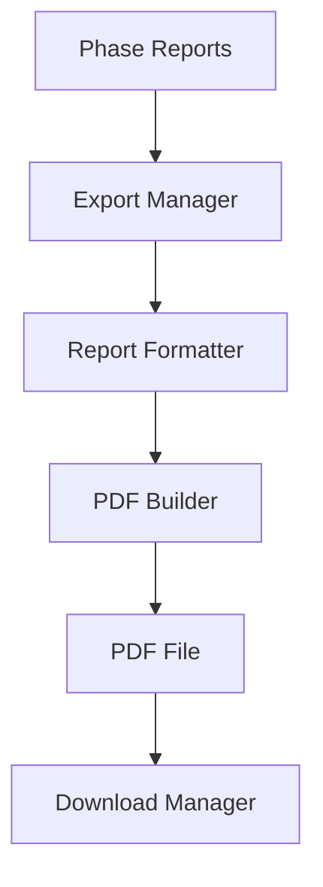

# Phase 10: PDF Export System

> **Project:** StudyPilot AI
> **Phase:** 10 of N — PDF Export System
> **Status:** Implementation-Ready
> **Author:** StudyPilot AI Development Team
> **Last Updated:** June 2025

---

## Table of Contents

1. [Objective](#objective)
2. [Features](#features)
3. [User Flow](#user-flow)
4. [Inputs](#inputs)
5. [Outputs](#outputs)
6. [Components](#components)
7. [Export Logic](#export-logic)
8. [Technical Architecture](#technical-architecture)
9. [API Design](#api-design)
10. [Data Structures](#data-structures)
11. [Libraries and Dependencies](#libraries-and-dependencies)
12. [Folder Structure](#folder-structure)
13. [Implementation Steps](#implementation-steps)
14. [Performance Optimization](#performance-optimization)
15. [Edge Cases](#edge-cases)
16. [Testing Checklist](#testing-checklist)
17. [Completion Criteria](#completion-criteria)

---

## Objective

Phase 10 serves as the final output and reporting system of StudyPilot AI.

Its purpose is to combine all information generated throughout the platform into a professional, downloadable PDF report that students can save, print, share, or use for revision before exams.

Instead of forcing users to navigate multiple pages, the PDF Export System consolidates:

* AI-generated summaries
* Key concepts
* Flashcards
* Quiz performance
* Weak topics
* Exam readiness score
* Study planner
* Predicted exam score
* Revision sheet

into one structured document.

This phase acts as the final deliverable of the entire StudyPilot AI workflow.

---

## Features

### Full Study Report Export

Generate a complete report containing all learning materials.

Example:

```text
StudyPilot AI Report

Subject: Database Systems

Generated On: June 20, 2025
```

---

### Summary Export

Include:

```text
Short Summary

Detailed Summary
```

Generated in Phase 2.

---

### Key Concepts Export

Include:

```text
Joins
Transactions
Views
Triggers
Stored Procedures
```

Generated in Phase 2.

---

### Flashcards Export

Include:

```text
Q: What is a Trigger?

A: A stored program that automatically executes.
```

Generated in Phase 3.

---

### Quiz Performance Export

Include:

```text
Quiz Score: 8/10

Accuracy: 80%
```

Generated in Phase 5.

---

### Weak Topic Report

Include:

```text
Weak Topics

Transactions
Triggers
```

Generated in Phase 5.

---

### Exam Readiness Export

Include:

```text
Exam Readiness: 76%
```

Generated in Phase 5.

---

### Study Plan Export

Include:

```text
Day 1
Transactions (60 mins)

Day 2
Triggers (45 mins)
```

Generated in Phase 6.

---

### Predicted Performance Export

Include:

```text
Expected Exam Score:
84%

Probability of A Grade:
72%
```

Generated in Phase 8.

---

### Revision Sheet Export

Include:

```text
Top Concepts

Common Mistakes

Exam Tips
```

Generated in Phase 3.

---

## User Flow

```text
1. User completes all learning activities
        │
2. Reports generated across phases
        │
3. User opens Export Page
        │
4. User clicks Generate PDF
        │
5. Export Manager collects all data
        │
6. PDF document created
        │
7. File saved temporarily
        │
8. Download button displayed
        │
9. User downloads report
```

---

## Inputs

| Input              | Type   | Description         |
| ------------------ | ------ | ------------------- |
| Summary Data       | `dict` | Output from Phase 2 |
| Concept Data       | `dict` | Output from Phase 2 |
| Flashcards         | `list` | Output from Phase 3 |
| Revision Sheet     | `dict` | Output from Phase 3 |
| Performance Report | `dict` | Output from Phase 5 |
| Study Plan         | `dict` | Output from Phase 6 |
| Prediction Report  | `dict` | Output from Phase 8 |

---

## Outputs

| Output         | Type   | Description               |
| -------------- | ------ | ------------------------- |
| PDF File       | `pdf`  | Final downloadable report |
| Export Summary | `dict` | Export metadata           |
| Download Link  | `str`  | Streamlit download button |

---

## Components

### Export Manager

**Suggested file:** `modules/pdf_export.py`

Responsible for coordinating export generation.

**Responsibilities:**

* Collect reports
* Validate data
* Build export structure

---

### PDF Builder

**Suggested file:** `modules/pdf_builder.py`

Responsible for PDF generation.

**Responsibilities:**

* Create pages
* Format content
* Insert sections

---

### Report Formatter

**Suggested file:** `modules/report_formatter.py`

Responsible for styling.

**Responsibilities:**

* Create headings
* Format tables
* Format lists

---

### Export Validator

**Suggested file:** `modules/export_validator.py`

Responsible for validation.

**Responsibilities:**

* Verify required data exists
* Detect missing sections
* Prevent corrupted export

---

### Download Manager

**Suggested file:** `modules/download_manager.py`

Responsible for downloads.

**Responsibilities:**

* Store PDF temporarily
* Generate download link
* Manage cleanup

---

## Export Logic

### Step 1: Collect Reports

```python
all_reports = {
    "summary": summary,
    "flashcards": flashcards,
    "performance": performance,
    "planner": planner,
    "prediction": prediction
}
```

---

### Step 2: Validate Reports

```python
validate_export(all_reports)
```

---

### Step 3: Build PDF Sections

```python
sections = [
    summary_section,
    concepts_section,
    flashcard_section,
    quiz_section,
    planner_section,
    prediction_section
]
```

---

### Step 4: Generate PDF

```python
pdf.build(sections)
```

---

### Step 5: Download

```python
st.download_button(...)
```

---

## Technical Architecture

```text
Phase Reports
        │
        ▼
Export Manager
        │
        ▼
Report Formatter
        │
        ▼
PDF Builder
        │
        ▼
PDF File
        │
        ▼
Download Manager
```

### Mermaid Diagram



---

## API Design

### `generate_pdf(report_data: dict) -> bytes`

Creates PDF file.

```python
pdf = generate_pdf(all_reports)
```

---

### `validate_export(data: dict) -> bool`

Validates export data.

```python
valid = validate_export(report_data)
```

---

### `build_report_sections(data: dict) -> list`

Creates report sections.

```python
sections = build_report_sections(data)
```

---

### `get_download_link(pdf: bytes)`

Creates download link.

```python
download_link = get_download_link(pdf)
```

---

## Data Structures

### Export Summary

```json
{
  "generated_at": "2025-06-20",
  "sections": 8,
  "pages": 12
}
```

---

### PDF Metadata

```json
{
  "title": "StudyPilot AI Report",
  "author": "StudyPilot AI",
  "subject": "Database Systems"
}
```

---

### Full Export Object

```json
{
  "summary": {},
  "concepts": {},
  "flashcards": [],
  "performance": {},
  "planner": {},
  "prediction": {}
}
```

---

## Libraries and Dependencies

| Library     | Purpose                |
| ----------- | ---------------------- |
| `reportlab` | PDF generation         |
| `streamlit` | Download interface     |
| `datetime`  | Report timestamps      |
| `json`      | Data serialization     |
| `typing`    | Type hints             |
| `io`        | In-memory PDF creation |

---

## Folder Structure

```text
StudyPilotAI/
│
├── modules/
│   ├── pdf_export.py
│   ├── pdf_builder.py
│   ├── report_formatter.py
│   ├── export_validator.py
│   └── download_manager.py
│
├── templates/
│   └── report_template.py
│
├── tests/
│   └── test_phase10.py
│
└── phase10_pipeline.py
```

---

## Implementation Steps

1. Create pdf_export.py.
2. Create PDF builder.
3. Load all reports.
4. Validate reports.
5. Build report structure.
6. Create title page.
7. Add summaries section.
8. Add concepts section.
9. Add flashcards section.
10. Add quiz results section.
11. Add weak topics section.
12. Add readiness section.
13. Add study planner section.
14. Add prediction section.
15. Add revision sheet section.
16. Generate PDF.
17. Store PDF in memory.
18. Create download button.
19. Test export.
20. Complete integration.

---

## Performance Optimization

* Generate PDF only on demand.
* Use in-memory PDF creation.
* Avoid regenerating reports.
* Cache export data.
* Compress large reports.
* Limit flashcard count if necessary.

---

## Edge Cases

| Edge Case              | Handling Strategy |
| ---------------------- | ----------------- |
| Missing summary        | Skip section      |
| Missing flashcards     | Skip section      |
| Missing planner        | Skip section      |
| Missing predictor      | Skip section      |
| Empty report           | Show export error |
| Large report           | Split into pages  |
| PDF generation failure | Show retry option |
| Download failure       | Regenerate file   |

---

## Testing Checklist

* [ ] PDF generates successfully
* [ ] Summary included
* [ ] Concepts included
* [ ] Flashcards included
* [ ] Quiz results included
* [ ] Weak topics included
* [ ] Readiness included
* [ ] Planner included
* [ ] Prediction included
* [ ] Revision sheet included
* [ ] Download button works
* [ ] PDF opens correctly
* [ ] No corrupted pages
* [ ] Missing sections handled
* [ ] Full integration tested

---

## Completion Criteria

Phase 10 is complete when:

* [ ] PDF generated successfully
* [ ] All available reports included
* [ ] Missing sections handled gracefully
* [ ] Download works
* [ ] PDF formatting correct
* [ ] Multi-page reports supported
* [ ] Export pipeline stable
* [ ] Integration with all previous phases complete
* [ ] Streamlit export page operational
* [ ] End-to-end report generation works

---

*End of Phase 10: PDF Export System Documentation*
*StudyPilot AI — Hackathon Development Build*
