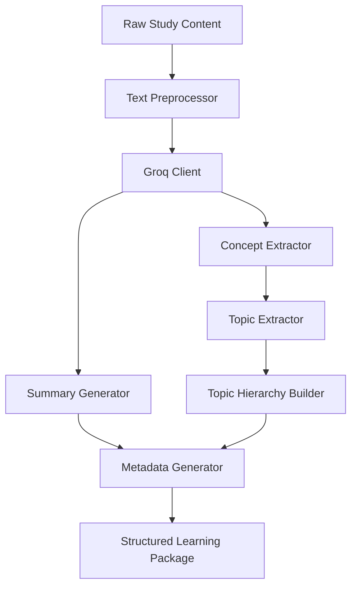

# Phase 2: AI Processing Engine

> **Project:** StudyPilot AI
> **Phase:** 2 of N — AI Processing Engine
> **Status:** Implementation-Ready
> **Author:** StudyPilot AI Development Team
> **Last Updated:** June 2025

---

## Table of Contents

1. [Objective](#objective)
2. [Features](#features)
3. [User Flow](#user-flow)
4. [Inputs](#inputs)
5. [Outputs](#outputs)
6. [Components](#components)
7. [Prompt Engineering Design](#prompt-engineering-design)
8. [Technical Architecture](#technical-architecture)
9. [API Design](#api-design)
10. [Data Structures](#data-structures)
11. [Libraries and Dependencies](#libraries-and-dependencies)
12. [Folder Structure](#folder-structure)
13. [Implementation Steps](#implementation-steps)
14. [Performance Optimization](#performance-optimization)
15. [Edge Cases](#edge-cases)
16. [Testing Checklist](#testing-checklist)
17. [Completion Criteria](#completion-criteria)

---

## Objective

Phase 2 serves as the **core intelligence layer** of StudyPilot AI. It receives raw, unstructured study content produced by Phase 1 — whether extracted from PDFs, handwritten notes, or YouTube transcripts — and transforms it into clean, structured educational material using the **Groq LLM API**.

The central goal is to eliminate the friction between raw content and meaningful learning. A student who uploads a 40-page chapter on Database Systems should immediately receive a concise summary, an organized list of key concepts, a hierarchical topic tree, and metadata that tells them how long it will take to study and how difficult the content is. All of this happens automatically, without any manual tagging or categorization.

The structured output produced by Phase 2 becomes the **shared data foundation** consumed by every downstream module: flashcard generation, quiz creation, weak topic detection, study planning, mind map rendering, and AI doubt solving. Getting Phase 2 right is the most critical engineering task in the entire system.

---

## Features

### Short Summary Generator

Produces a **100–200 word high-level overview** of the uploaded study material. This summary is designed to be read in under one minute and gives the student a rapid mental model of what the content covers before diving deeper.

**Requirements:**
- Length strictly between 100 and 200 words
- Written in plain, student-friendly language
- Covers all major themes present in the content
- Avoids technical jargon unless it is a core concept
- Suitable for use as a preview card in the UI

---

### Detailed Summary Generator

Produces a **section-wise comprehensive breakdown** of the study content. Unlike the short summary, this output mirrors the logical structure of the original material and is suitable for in-depth review or revision.

**Requirements:**
- Comprehensive coverage of all topics in the content
- Organized by logical sections or themes (not arbitrary paragraph splits)
- Includes important definitions and key terminology
- Highlights relationships and dependencies between concepts
- Suitable for use as a full revision document

---

### Key Concepts Extractor

Identifies and extracts the **most important ideas, terms, definitions, and principles** present in the content.

**Example output for Database Systems content:**

```
Database Systems
  ├── Joins
  ├── Transactions
  ├── Views
  ├── Triggers
  └── Stored Procedures
```

**Requirements:**
- Extract all major and minor concepts
- Deduplicate semantically equivalent concepts (e.g., "JOIN" and "SQL JOIN")
- Rank concepts by importance using frequency and contextual weight
- Output as a flat ranked list and as a grouped structure

---

### Topic Extraction Engine

Identifies and names all **major study topics** present in the content. Topics are higher-level than concepts and represent distinct areas a student must understand.

**Example output:**

```
Topic 1: Joins (Relevance: 0.95)
Topic 2: Transactions (Relevance: 0.88)
Topic 3: Views (Relevance: 0.74)
Topic 4: Triggers (Relevance: 0.70)
```

**Requirements:**
- Detect all distinct major topics
- Generate clean, human-readable topic names
- Assign a relevance score between 0.0 and 1.0 based on coverage depth
- Avoid overly granular sub-topics (those belong in the hierarchy)

---

### Topic Hierarchy Builder

Organizes extracted topics into a **parent-child tree structure** representing how concepts relate to one another. This hierarchy is the data backbone for future mind map generation.

**Example output:**

```
Database Systems
├── Joins
│   ├── Inner Join
│   └── Outer Join
├── Transactions
│   ├── ACID Properties
│   └── Concurrency Control
├── Views
└── Triggers
```

**Requirements:**
- Establish meaningful parent-child relationships between topics
- Support multi-level nesting (minimum 2 levels, up to 4 levels)
- Output as both a nested JSON object and a human-readable tree string
- Designed to be directly consumed by the Mind Map Generator in a future phase

---

### Learning Metadata Generator

Computes **quantitative and qualitative metadata** about the study material to help students plan their sessions.

**Generated fields:**
- **Estimated Complexity:** Low / Medium / High / Expert
- **Topic Count:** Total number of distinct topics
- **Concept Count:** Total number of extracted key concepts
- **Content Length:** Word count of the original material
- **Difficulty Level:** Beginner / Intermediate / Advanced
- **Estimated Study Time:** In hours, based on content depth and complexity

---

## User Flow

```
1.  Raw Study Content received from Phase 1
        │
2.  Text Preprocessor cleans and chunks the content
        │
3.  Preprocessed text sent to Groq API via Groq Client
        │
4.  Short Summary generated and stored
        │
5.  Detailed Summary generated and stored
        │
6.  Key Concepts extracted, deduplicated, and ranked
        │
7.  Major Topics identified and scored for relevance
        │
8.  Topic Hierarchy constructed from topics and concepts
        │
9.  Learning Metadata computed from all prior outputs
        │
10. Structured Learning Package assembled as unified JSON
        │
11. Package passed to downstream modules (Flashcard,
    Quiz, Planner, Doubt Solver, Mind Map Generator)
```

---

## Inputs

| Input | Type | Description |
|---|---|---|
| Raw Study Content | `str` | Plain text extracted from PDF, notes, or YouTube transcript by Phase 1 |
| Content Title (optional) | `str` | Optional title or subject label provided by the user |
| Content Source (optional) | `str` | Enum: `pdf`, `notes`, `youtube` — used to adjust preprocessing strategy |

---

## Outputs

| Output | Type | Description |
|---|---|---|
| Short Summary | `str` | 100–200 word high-level overview of the content |
| Detailed Summary | `str` | Comprehensive section-wise breakdown with definitions and relationships |
| Key Concepts | `list[str]` | Ranked list of important concepts extracted from the content |
| Topics | `list[dict]` | List of major topics with names and relevance scores |
| Topic Hierarchy | `dict` | Nested tree structure representing parent-child topic relationships |
| Metadata | `dict` | Complexity, difficulty, topic count, concept count, and estimated study time |

---

## Components

### Text Preprocessor

**Suggested file:** `modules/text_preprocessor.py`

Responsible for sanitizing and preparing raw content before it is passed to the Groq API. Raw content from PDFs and transcripts often contains noise that degrades LLM output quality — stray characters, repeated whitespace, malformed encodings, or excessively long sequences that exceed the model's context window.

**Responsibilities:**
- Strip unnecessary whitespace, newlines, and control characters
- Normalize Unicode characters and smart quotes
- Detect content length and split into manageable chunks if it exceeds the token budget
- Assemble the final prompt string from cleaned chunks
- Add section headers if the content appears to be structured (e.g., detected heading patterns)

---

### Groq Client

**Suggested file:** `modules/groq_client.py`

The single point of contact with the Groq LLM API. All API calls in Phase 2 pass through this module, ensuring centralized error handling, authentication management, and response normalization.

**Responsibilities:**
- Load the Groq API key from environment variables (never hardcode)
- Send prompt payloads to the configured model (`llama3-70b-8192` or `mixtral-8x7b-32768`)
- Handle HTTP errors, timeouts, and rate limit responses with exponential backoff
- Return normalized response text to the calling module
- Log all API calls with token counts for debugging

---

### Summary Generator

**Suggested file:** `modules/summarizer.py`

Calls the Groq Client with carefully constructed prompts to produce both the short and detailed summaries. Validates output length before returning.

**Responsibilities:**
- Compose the short summary prompt and invoke the Groq Client
- Compose the detailed summary prompt and invoke the Groq Client
- Validate that short summary is within the 100–200 word target range
- Trim or re-request if length constraints are violated

---

### Concept Extractor

**Suggested file:** `modules/concept_extractor.py`

Extracts and ranks key concepts from the study content. Uses post-processing to deduplicate and normalize concept names before returning.

**Responsibilities:**
- Request concept list from Groq Client using a structured extraction prompt
- Parse the JSON response into a Python list
- Normalize concept names (title case, remove duplicates, strip filler phrases)
- Rank concepts by importance score or order of appearance

---

### Topic Extractor

**Suggested file:** `modules/topic_extractor.py`

Identifies distinct study topics and assigns relevance scores. Works closely with the Concept Extractor to avoid duplication of output.

**Responsibilities:**
- Request topic list with relevance scores from Groq Client
- Parse the structured JSON response
- Validate that topics are meaningfully distinct from one another
- Feed cleaned topic list to the Topic Hierarchy Builder

---

### Metadata Generator

**Suggested file:** `modules/metadata_generator.py`

Computes the final metadata object from the outputs of all prior modules.

**Responsibilities:**
- Count topics and concepts from extractor outputs
- Measure word count of original raw content
- Request difficulty and complexity estimates from Groq Client using a short prompt
- Calculate estimated study time using a heuristic formula based on word count and complexity
- Assemble final `metadata` dict

---

## Prompt Engineering Design

All prompts are designed for JSON output, determinism, and minimal hallucination.

---

### Short Summary Prompt

```text
You are a professional educational content summarizer.

Summarize the following study content in exactly 100 to 200 words.
The summary must be clear, accurate, and cover all major concepts.
Write in simple language suitable for a university student.
Do not include headings or bullet points — write in plain prose.

Content:
{raw_content}
```

**Why this works:** The explicit word count constraint reduces variance. Specifying the audience (university student) calibrates vocabulary. Prohibiting headers and bullets enforces a clean prose format that fits the summary card UI.

---

### Detailed Summary Prompt

```text
You are an expert academic tutor.

Write a detailed, section-wise summary of the following study content.
Organize the summary by logical topic sections. For each section:
- Provide a clear heading
- Explain the key ideas in 3–5 sentences
- Define any important technical terms
- Describe relationships between concepts where relevant

Content:
{raw_content}
```

**Why this works:** Requesting section-wise output ensures the model follows the structure of the original content rather than producing a flat block of text. Explicitly asking for definitions and relationships increases educational value.

---

### Concept Extraction Prompt

```text
You are a knowledge extraction engine.

Extract all key concepts from the following study content.
Return ONLY a valid JSON array of strings. No explanation, no markdown.
Rank the concepts from most important to least important.
Remove any duplicates.

Example output:
["Joins", "Transactions", "ACID Properties", "Views", "Triggers"]

Content:
{raw_content}
```

**Why this works:** Explicit JSON-only instruction prevents markdown wrapping. Providing an example output anchors the format. The ranking instruction extracts implicit importance signals from the model.

---

### Topic Extraction Prompt

```text
You are a curriculum design specialist.

Identify all major study topics in the following content.
Return ONLY a valid JSON array of objects with this structure:
[{"name": "Topic Name", "importance": 0.95}]

Rules:
- importance is a float between 0.0 and 1.0
- Topics must be distinct and non-overlapping
- Use clean, human-readable names
- Return no more than 12 topics

Content:
{raw_content}
```

**Why this works:** Hard-capping at 12 topics prevents over-granulation. The schema definition ensures consistent output that can be parsed directly without additional normalization.

---

### Metadata Generation Prompt

```text
You are an educational assessment engine.

Based on the following study content, estimate:
1. difficulty_level: one of ["Beginner", "Intermediate", "Advanced"]
2. complexity: one of ["Low", "Medium", "High", "Expert"]

Return ONLY a valid JSON object:
{"difficulty_level": "...", "complexity": "..."}

Content:
{raw_content[:2000]}
```

**Why this works:** Only the first 2000 characters are sent — sufficient for difficulty estimation and avoids burning tokens on a simple classification task. The output schema is minimal and unambiguous.

---

## Technical Architecture

### Architecture Overview

```
Phase 1 Output
     │
     ▼
┌─────────────────────┐
│   Text Preprocessor  │  ← Clean, chunk, normalize raw content
└────────┬────────────┘
         │
         ▼
┌─────────────────────┐
│     Groq Client      │  ← Authenticated API gateway with retry logic
└────────┬────────────┘
         │
    ┌────┴──────────────────────────────────┐
    │                                       │
    ▼                                       ▼
┌──────────────┐                   ┌──────────────────┐
│   Summarizer  │                   │ Concept Extractor │
│ (short+detail)│                   │ (ranked list)     │
└──────┬───────┘                   └──────┬───────────┘
       │                                  │
       │                         ┌────────▼──────────┐
       │                         │  Topic Extractor   │
       │                         │  (scored topics)   │
       │                         └────────┬──────────┘
       │                                  │
       │                         ┌────────▼──────────┐
       │                         │  Hierarchy Builder │
       │                         │  (topic tree)      │
       │                         └────────┬──────────┘
       │                                  │
       └──────────────┬───────────────────┘
                      │
              ┌───────▼──────────┐
              │ Metadata Generator│
              └───────┬──────────┘
                      │
                      ▼
          ┌───────────────────────┐
          │  Structured Learning  │
          │       Package (JSON)  │
          └───────────────────────┘
```

### Mermaid Diagram



---

## API Design

All functions follow a consistent contract: they accept preprocessed text (or intermediate structured data) and return typed Python objects. All public functions are synchronous in v1 and can be made async in v2.

---

### `generate_short_summary(text: str) -> str`

```python
# Request
text = "Database systems are used to store and manage data..."

# Response
"Database systems are fundamental tools for organizing and retrieving structured data.
 This content covers core relational concepts including joins, which combine rows from
 multiple tables, and transactions, which ensure data consistency using ACID properties..."
```

---

### `generate_detailed_summary(text: str) -> str`

```python
# Request
text = "Database systems are used to store and manage data..."

# Response (truncated)
"## Joins\nJoins are SQL operations that combine rows from two or more tables...
 ## Transactions\nA transaction is a sequence of operations performed as a single
 logical unit of work..."
```

---

### `extract_concepts(text: str) -> list[str]`

```python
# Request
text = "..."

# Response
["Joins", "Transactions", "ACID Properties", "Views", "Triggers", "Stored Procedures"]
```

---

### `extract_topics(text: str) -> list[dict]`

```python
# Request
text = "..."

# Response
[
    {"name": "Joins", "importance": 0.95},
    {"name": "Transactions", "importance": 0.88},
    {"name": "Views", "importance": 0.74}
]
```

---

### `generate_metadata(text: str, topics: list, concepts: list) -> dict`

```python
# Request
text = "...", topics = [...], concepts = [...]

# Response
{
    "difficulty_level": "Intermediate",
    "complexity": "Medium",
    "topic_count": 8,
    "concept_count": 23,
    "content_length_words": 4200,
    "estimated_study_time": "4 hours"
}
```

---

## Data Structures

### Full Structured Learning Package

```json
{
  "short_summary": "Database systems are fundamental tools for organizing and retrieving structured data. This content covers joins, transactions, views, triggers, and stored procedures...",

  "detailed_summary": "## Joins\nJoins are SQL operations that combine rows from two or more related tables...\n## Transactions\nTransactions ensure data integrity using ACID properties...",

  "concepts": [
    "Joins",
    "Transactions",
    "ACID Properties",
    "Views",
    "Triggers",
    "Stored Procedures",
    "Normalization",
    "Primary Key"
  ],

  "topics": [
    {"name": "Joins", "importance": 0.95},
    {"name": "Transactions", "importance": 0.88},
    {"name": "Views", "importance": 0.74},
    {"name": "Triggers", "importance": 0.70}
  ],

  "topic_hierarchy": {
    "root": "Database Systems",
    "children": [
      {
        "name": "Joins",
        "children": [
          {"name": "Inner Join", "children": []},
          {"name": "Outer Join", "children": []}
        ]
      },
      {
        "name": "Transactions",
        "children": [
          {"name": "ACID Properties", "children": []},
          {"name": "Concurrency Control", "children": []}
        ]
      },
      {"name": "Views", "children": []},
      {"name": "Triggers", "children": []}
    ]
  },

  "metadata": {
    "difficulty_level": "Intermediate",
    "complexity": "Medium",
    "topic_count": 8,
    "concept_count": 23,
    "content_length_words": 4200,
    "estimated_study_time": "4 hours"
  }
}
```

---

## Libraries and Dependencies

| Library | Purpose |
|---|---|
| `groq` | Official Groq Python SDK — used to authenticate and send requests to the Groq LLM API |
| `streamlit` | Frontend framework — displays Phase 2 results in the UI as summary cards, concept chips, and topic trees |
| `pydantic` | Data validation — enforces schema compliance on all structured outputs (topics, metadata) before they are stored or passed downstream |
| `json` | Standard library — used to parse all LLM JSON responses and serialize the final Structured Learning Package |
| `typing` | Standard library — provides `list`, `dict`, `Optional`, and `Union` type hints for function signatures |
| `re` | Standard library — used in the Text Preprocessor to clean whitespace, detect section headers, and strip control characters |

---

## Folder Structure

```
StudyPilotAI/
│
├── modules/
│   ├── groq_client.py           # API gateway and authentication
│   ├── text_preprocessor.py     # Content cleaning and chunking
│   ├── summarizer.py            # Short and detailed summary generation
│   ├── concept_extractor.py     # Key concept extraction and ranking
│   ├── topic_extractor.py       # Topic identification and scoring
│   ├── hierarchy_builder.py     # Topic tree construction
│   └── metadata_generator.py    # Metadata computation
│
├── prompts/
│   └── phase2_prompts.py        # All Groq prompt templates (centralized)
│
├── schemas/
│   └── learning_package.py      # Pydantic models for output validation
│
├── tests/
│   └── test_phase2.py           # Unit and integration tests for Phase 2
│
└── phase2_pipeline.py           # Orchestrator: runs all Phase 2 modules in order
```

---

## Implementation Steps

1. **Set up the Groq SDK** — install the `groq` Python package and verify API key access with a test call.
2. **Create the project folder structure** — initialize all module files listed above as empty stubs.
3. **Implement `text_preprocessor.py`** — write and test the cleaning and chunking logic independently using sample raw content.
4. **Write unit tests for the preprocessor** — verify that whitespace normalization, Unicode handling, and chunking work correctly on edge case inputs.
5. **Implement `groq_client.py`** — build the API wrapper with environment variable key loading, model configuration, and basic error handling.
6. **Add retry logic to the Groq Client** — implement exponential backoff for HTTP 429 (rate limit) and 503 (service unavailable) responses.
7. **Centralize all prompts in `prompts/phase2_prompts.py`** — write all five prompt templates as Python format strings with `{raw_content}` placeholders.
8. **Implement `summarizer.py`** — wire up short and detailed summary generation with output length validation.
9. **Test the summarizer** — run with 3 different content samples (short notes, medium PDF extract, long transcript) and evaluate output quality.
10. **Implement `concept_extractor.py`** — write extraction logic with JSON parsing, deduplication, and normalization.
11. **Add robust JSON parsing to the extractor** — handle cases where the model wraps output in markdown code fences by stripping backticks before parsing.
12. **Implement `topic_extractor.py`** — extract topics with relevance scores and validate that importance values are valid floats in `[0.0, 1.0]`.
13. **Implement `hierarchy_builder.py`** — build the nested topic tree using a second Groq call or by constructing the hierarchy programmatically from topic relationships.
14. **Implement `metadata_generator.py`** — compute static fields (word count, topic count, concept count) and request difficulty/complexity from Groq using the short prompt.
15. **Define Pydantic schemas in `schemas/learning_package.py`** — create `TopicSchema`, `MetadataSchema`, and `LearningPackageSchema` models.
16. **Validate all outputs through Pydantic** — add validation calls after each module and log validation errors to the console.
17. **Build the orchestrator `phase2_pipeline.py`** — chain all module calls in order, pass outputs between modules, and assemble the final JSON package.
18. **Write integration tests in `test_phase2.py`** — test the full pipeline end-to-end with a real Groq API call using a fixture content file.
19. **Integrate with the Streamlit frontend** — display short summary as a card, concepts as chips, topics as a scrollable list, and metadata as a stat bar.
20. **Add response caching** — cache Groq responses keyed on a hash of the input content to avoid redundant API calls during development and demos.
21. **Implement token estimation** — before each API call, estimate token count and truncate input if it approaches the model's context limit.
22. **Add structured logging** — log API call duration, token usage, and module execution time for performance monitoring.
23. **Write the `.env.example` file** — document all required environment variables (`GROQ_API_KEY`, `GROQ_MODEL`, etc.).
24. **Conduct a full hackathon demo dry-run** — run the pipeline on three diverse content types and verify outputs meet quality expectations.
25. **Document all public functions** — add Google-style docstrings to every function in every module.

---

## Performance Optimization

**Prompt Optimization:** Keep prompts concise. Every token in the prompt consumes part of the context window and adds latency. Remove explanatory sentences that are not necessary for output quality. Use few-shot examples only when zero-shot performance is insufficient.

**Token Reduction:** Truncate input content to the minimum length needed for accurate output. For metadata generation, the first 2000 characters are sufficient. For concept and topic extraction, send a maximum of 6000 tokens. For full summaries, send the complete content but chunk documents longer than 8000 tokens.

**Response Caching:** Hash the preprocessed input text using `hashlib.md5` and cache the full Groq response in a local dictionary (or Redis for production). On a cache hit, skip the API call entirely. This is critical during hackathon demos to avoid rate limits and reduce wait times.

**Chunking Strategy:** For content exceeding the model's context window, split into overlapping chunks of 4000 tokens with a 200-token overlap. Process each chunk independently and merge results using deduplication logic. For summaries, summarize each chunk first, then summarize the combined chunk summaries (map-reduce approach).

**API Retry Mechanism:** Implement exponential backoff starting at 1 second, doubling on each retry, capped at 30 seconds, with a maximum of 5 attempts. Log each retry attempt with the error code and wait duration. After 5 failures, raise a descriptive exception that the frontend can catch and display to the user.

---

## Edge Cases

| Edge Case | Detection | Handling Strategy |
|---|---|---|
| **Empty content** | `len(text.strip()) == 0` | Return early with an error message before making any API call |
| **Extremely long notes** | Token estimate > model limit | Chunk content and process in parallel; merge outputs with deduplication |
| **API timeout** | `requests.Timeout` exception | Retry up to 3 times with backoff; surface a user-friendly error after exhausting retries |
| **Rate limits (HTTP 429)** | Response status 429 | Respect the `Retry-After` header; implement exponential backoff |
| **Invalid JSON response** | `json.JSONDecodeError` | Strip markdown fences and retry parse; if still invalid, prompt the model again with stricter instructions |
| **Hallucinated topics** | Topics not found in original text | Post-process by verifying each extracted topic appears (case-insensitive) in the original content; remove topics with zero matches |
| **Duplicate concepts** | Case-insensitive comparison | Normalize all concept strings to title case before deduplication using a set |
| **Single-sentence content** | Word count < 50 | Skip detailed summary; return short summary only with a UI warning |
| **Non-English content** | Language detection via `langdetect` | Flag the content and either reject with a message or route to a multilingual model |

---

## Testing Checklist

**Unit Tests — Text Preprocessor**
- [ ] Empty string input returns empty string without raising an exception
- [ ] Input with excessive whitespace is normalized to single spaces
- [ ] Content exceeding 8000 tokens is correctly split into chunks
- [ ] Unicode control characters are stripped from output
- [ ] Section headers in the raw content are preserved after cleaning

**Unit Tests — Groq Client**
- [ ] Missing API key raises a descriptive `EnvironmentError`
- [ ] Successful API call returns non-empty string response
- [ ] HTTP 429 response triggers retry logic with backoff
- [ ] HTTP 503 response triggers retry and eventually raises after max attempts
- [ ] Timeout exception is caught and re-raised with a descriptive message

**Unit Tests — Summary Generator**
- [ ] Short summary output is between 100 and 200 words
- [ ] Detailed summary contains at least 2 section headings
- [ ] Short summary does not contain bullet points or markdown headers
- [ ] Empty input raises `ValueError` before calling the API

**Unit Tests — Concept Extractor**
- [ ] Output is a valid Python list of strings
- [ ] No duplicate concepts in the returned list
- [ ] All concept names are in title case after normalization
- [ ] JSON response wrapped in markdown code fences is correctly parsed

**Unit Tests — Topic Extractor**
- [ ] Output is a list of dicts with `name` and `importance` keys
- [ ] All `importance` values are floats in the range `[0.0, 1.0]`
- [ ] Topic count does not exceed 12
- [ ] Topic names do not duplicate concept names (they are higher-level)

**Unit Tests — Hierarchy Builder**
- [ ] Output contains a `root` key and a `children` list
- [ ] Each child node has a `name` and `children` key
- [ ] Hierarchy depth is at least 2 levels for content with more than 5 topics
- [ ] All extracted topics appear somewhere in the hierarchy

**Unit Tests — Metadata Generator**
- [ ] `difficulty_level` is one of the four permitted values
- [ ] `complexity` is one of the four permitted values
- [ ] `topic_count` matches the length of the topics list
- [ ] `concept_count` matches the length of the concepts list
- [ ] `estimated_study_time` is a non-empty string

**Integration Tests — Full Pipeline**
- [ ] Pipeline produces valid output for a short 200-word text input
- [ ] Pipeline produces valid output for a long 5000-word PDF extract
- [ ] Final JSON output passes Pydantic schema validation
- [ ] Pipeline completes in under 30 seconds for average-length content
- [ ] Caching correctly serves a cached result on the second identical request

---

## Completion Criteria

Phase 2 is considered **complete and ready to hand off** to downstream modules when all of the following are true:

- [ ] Short summary is generated for any valid input within the 100–200 word target
- [ ] Detailed summary is generated with at least 2 logical sections for any input longer than 300 words
- [ ] Key concepts are extracted, deduplicated, and returned as a ranked list
- [ ] Topics are identified with valid relevance scores and returned as structured objects
- [ ] Topic hierarchy is produced as a valid nested JSON tree with at least 2 levels
- [ ] Learning metadata is generated with all required fields populated
- [ ] The final Structured Learning Package validates successfully against the Pydantic schema
- [ ] All API failures are handled gracefully — no unhandled exceptions reach the frontend
- [ ] Response caching is operational and verified to skip redundant API calls
- [ ] The full pipeline runs end-to-end in under 30 seconds on average hardware
- [ ] All 25 test cases in the testing checklist pass
- [ ] The orchestrator (`phase2_pipeline.py`) is importable and callable by Phase 3 modules

---

*End of Phase 2: AI Processing Engine Documentation*
*StudyPilot AI — Hackathon Development Build*
