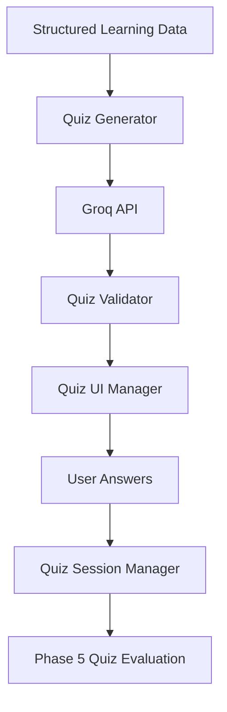

# Phase 4: Quiz Generator

> **Project:** StudyPilot AI
> **Phase:** 4 of N — Quiz Generator
> **Status:** Implementation-Ready
> **Author:** StudyPilot AI Development Team
> **Last Updated:** June 2025

---

## Table of Contents

- [Phase 4: Quiz Generator](#phase-4-quiz-generator)
  - [Table of Contents](#table-of-contents)
  - [Objective](#objective)
  - [Features](#features)
    - [MCQ Generator](#mcq-generator)
    - [Topic-Based Question Mapping](#topic-based-question-mapping)
    - [Answer Storage](#answer-storage)
    - [Difficulty Levels](#difficulty-levels)
    - [Quiz UI](#quiz-ui)
  - [User Flow](#user-flow)
  - [Inputs](#inputs)
  - [Outputs](#outputs)
  - [Components](#components)
    - [Quiz Generator](#quiz-generator)
    - [Quiz UI Manager](#quiz-ui-manager)
    - [Quiz Validator](#quiz-validator)
    - [Quiz Session Manager](#quiz-session-manager)
  - [Prompt Engineering Design](#prompt-engineering-design)
    - [Quiz Generation Prompt](#quiz-generation-prompt)
  - [Technical Architecture](#technical-architecture)
    - [Mermaid Diagram](#mermaid-diagram)
  - [API Design](#api-design)
    - [`generate_quiz(content: str, topics: list, num_questions: int) -> list[dict]`](#generate_quizcontent-str-topics-list-num_questions-int---listdict)
    - [`validate_quiz(quiz: list[dict]) -> list[dict]`](#validate_quizquiz-listdict---listdict)
    - [`save_user_answers(quiz: list[dict], answers: dict) -> dict`](#save_user_answersquiz-listdict-answers-dict---dict)
  - [Data Structures](#data-structures)
    - [Quiz Question Object](#quiz-question-object)
    - [Quiz Session Object](#quiz-session-object)
  - [Libraries and Dependencies](#libraries-and-dependencies)
  - [Folder Structure](#folder-structure)
  - [Implementation Steps](#implementation-steps)
  - [Performance Optimization](#performance-optimization)
  - [Edge Cases](#edge-cases)
  - [Testing Checklist](#testing-checklist)
  - [Completion Criteria](#completion-criteria)

---

## Objective

Phase 4 is responsible for generating quizzes from the structured learning material created in earlier phases. It converts summaries, topics, concepts, and flashcards into multiple-choice questions that students can use to test their understanding.

The goal of this phase is to move StudyPilot AI from passive revision into active testing. Instead of only reading summaries or flashcards, students can attempt quizzes, submit answers, and prepare for weak topic analysis in the next phase.

This phase directly supports the future **Quiz Evaluation**, **Weak Topic Detector**, **Exam Readiness Score**, and **Study Predictor** modules.

---

## Features

### MCQ Generator

Generates 10–20 multiple-choice questions from uploaded study content.

**Requirements:**

* Each question must have 4 options
* Only one correct answer per question
* Questions must be based on uploaded content
* Questions should cover multiple topics
* Avoid duplicate questions

---

### Topic-Based Question Mapping

Each question must be linked to a topic.

**Example:**

```json
{
  "question": "Which SQL join returns all records from the left table?",
  "topic": "Joins"
}
```

This mapping is required for weak topic detection later.

---

### Answer Storage

Stores correct answers separately from the displayed options.

**Requirements:**

* Save correct answer
* Save selected answer
* Track question ID
* Track related topic

---

### Difficulty Levels

Generate questions with different difficulty levels.

**Levels:**

* Easy
* Medium
* Hard

---

### Quiz UI

Displays questions in a clean Streamlit interface.

**Requirements:**

* Radio buttons for options
* Submit button
* Progress indicator
* Prevent empty submission
* Store user responses in session state

---

## User Flow

```text
1. Structured learning data received from Phase 2 and Phase 3
        │
2. User opens Quiz page
        │
3. User selects number of questions
        │
4. System generates MCQs using Groq API
        │
5. Quiz questions are displayed in Streamlit
        │
6. User selects answers
        │
7. User submits quiz
        │
8. Answers are stored
        │
9. Data is passed to Phase 5 for evaluation
```

---

## Inputs

| Input               | Type         | Description                              |
| ------------------- | ------------ | ---------------------------------------- |
| Topics              | `list[dict]` | Extracted topics from Phase 2            |
| Key Concepts        | `list[str]`  | Important concepts from Phase 2          |
| Detailed Summary    | `str`        | Detailed explanation of uploaded content |
| Flashcards          | `list[dict]` | Optional flashcard data from Phase 3     |
| Number of Questions | `int`        | User-selected number of quiz questions   |

---

## Outputs

| Output            | Type         | Description                      |
| ----------------- | ------------ | -------------------------------- |
| Quiz Questions    | `list[dict]` | Generated MCQs                   |
| Correct Answers   | `dict`       | Correct answer for each question |
| User Answers      | `dict`       | User-selected answers            |
| Topic Mapping     | `dict`       | Maps each question to a topic    |
| Quiz Session Data | `dict`       | Complete quiz attempt data       |

---

## Components

### Quiz Generator

**Suggested file:** `modules/quiz_generator.py`

Responsible for generating MCQs using the Groq API.

**Responsibilities:**

* Generate quiz questions
* Create 4 options per question
* Assign one correct answer
* Add topic mapping
* Validate JSON response

---

### Quiz UI Manager

**Suggested file:** `modules/quiz_ui.py`

Handles quiz display inside Streamlit.

**Responsibilities:**

* Render questions
* Display radio buttons
* Track selected answers
* Prevent incomplete submission
* Store answers in session state

---

### Quiz Validator

**Suggested file:** `modules/quiz_validator.py`

Validates the structure and quality of generated questions.

**Responsibilities:**

* Check all questions have 4 options
* Check correct answer exists in options
* Remove duplicate questions
* Ensure each question has a topic
* Ensure each question has difficulty level

---

### Quiz Session Manager

**Suggested file:** `modules/quiz_session.py`

Stores quiz attempt data.

**Responsibilities:**

* Save generated quiz
* Save selected answers
* Track quiz status
* Prepare data for Phase 5

---

## Prompt Engineering Design

### Quiz Generation Prompt

```text
You are an expert educational quiz generator.

Create {num_questions} multiple-choice questions from the following study content.

Rules:
- Return ONLY valid JSON.
- Each question must have exactly 4 options.
- Only one option must be correct.
- Each question must include a related topic.
- Each question must include difficulty: Easy, Medium, or Hard.
- Questions must be based only on the provided content.
- Do not generate questions from outside knowledge.

JSON format:
[
  {
    "id": 1,
    "question": "Question text",
    "options": ["A", "B", "C", "D"],
    "correct_answer": "A",
    "topic": "Topic name",
    "difficulty": "Medium"
  }
]

Content:
{study_content}
```

**Why this works:**
The prompt forces structured JSON output and makes every question useful for later evaluation and weak topic detection.

---

## Technical Architecture

```text
Structured Learning Data
        │
        ▼
Quiz Generator
        │
        ▼
Groq API
        │
        ▼
Quiz Validator
        │
        ▼
Quiz UI Manager
        │
        ▼
User Answers
        │
        ▼
Quiz Session Manager
        │
        ▼
Phase 5: Quiz Evaluation
```

### Mermaid Diagram



---

## API Design

### `generate_quiz(content: str, topics: list, num_questions: int) -> list[dict]`

Generates quiz questions.

```python
quiz = generate_quiz(
    content=detailed_summary,
    topics=topics,
    num_questions=10
)
```

---

### `validate_quiz(quiz: list[dict]) -> list[dict]`

Validates generated quiz data.

```python
validated_quiz = validate_quiz(quiz)
```

---

### `save_user_answers(quiz: list[dict], answers: dict) -> dict`

Stores user responses.

```python
quiz_session = save_user_answers(quiz, answers)
```

---

## Data Structures

### Quiz Question Object

```json
{
  "id": 1,
  "question": "Which SQL join returns all records from the left table?",
  "options": [
    "INNER JOIN",
    "LEFT JOIN",
    "RIGHT JOIN",
    "CROSS JOIN"
  ],
  "correct_answer": "LEFT JOIN",
  "selected_answer": null,
  "topic": "Joins",
  "difficulty": "Easy"
}
```

---

### Quiz Session Object

```json
{
  "quiz_id": "quiz_001",
  "total_questions": 10,
  "questions": [],
  "user_answers": {
    "1": "LEFT JOIN",
    "2": "COMMIT"
  },
  "submitted": true
}
```

---

## Libraries and Dependencies

| Library     | Purpose                   |
| ----------- | ------------------------- |
| `streamlit` | Build quiz interface      |
| `groq`      | Generate MCQs using LLM   |
| `json`      | Parse quiz output         |
| `pydantic`  | Validate quiz schema      |
| `random`    | Shuffle questions/options |
| `typing`    | Type hints                |

---

## Folder Structure

```text
StudyPilotAI/
│
├── modules/
│   ├── quiz_generator.py
│   ├── quiz_validator.py
│   ├── quiz_ui.py
│   └── quiz_session.py
│
├── prompts/
│   └── phase4_prompts.py
│
├── schemas/
│   └── quiz_schema.py
│
├── tests/
│   └── test_phase4.py
│
└── phase4_pipeline.py
```

---

## Implementation Steps

1. Create `quiz_generator.py`.
2. Add Groq quiz generation prompt.
3. Accept topics and detailed summary as input.
4. Generate 10–20 MCQs.
5. Parse Groq JSON response.
6. Create `quiz_validator.py`.
7. Validate question count.
8. Validate 4 options per question.
9. Validate correct answer exists in options.
10. Validate topic field.
11. Validate difficulty field.
12. Remove duplicate questions.
13. Create `quiz_ui.py`.
14. Display questions using Streamlit radio buttons.
15. Store selected answers in `st.session_state`.
16. Add submit button.
17. Prevent submission if answers are missing.
18. Create `quiz_session.py`.
19. Save quiz attempt data.
20. Pass quiz session to Phase 5.

---

## Performance Optimization

* Cache generated quizzes using `st.cache_data`.
* Avoid regenerating quiz on every page refresh.
* Reuse Phase 2 structured output instead of sending full raw content again.
* Limit quiz generation to 10–20 questions for fast demo.
* Use JSON validation before rendering UI.
* Shuffle options only once per quiz session.

---

## Edge Cases

| Edge Case                           | Handling Strategy                       |
| ----------------------------------- | --------------------------------------- |
| Empty content                       | Show error and stop quiz generation     |
| No topics found                     | Generate general questions from summary |
| Groq returns invalid JSON           | Retry once with stricter prompt         |
| Duplicate questions                 | Remove duplicates automatically         |
| Correct answer missing from options | Reject question                         |
| User leaves answer empty            | Prevent submission                      |
| Too few questions generated         | Generate remaining questions again      |
| API failure                         | Show user-friendly error                |

---

## Testing Checklist

* [ ] Quiz generates successfully from detailed summary
* [ ] Quiz generates 10 questions
* [ ] Quiz supports 20 questions
* [ ] Every question has 4 options
* [ ] Every question has one correct answer
* [ ] Correct answer exists in options
* [ ] Every question has topic mapping
* [ ] Every question has difficulty level
* [ ] Duplicate questions are removed
* [ ] Streamlit radio buttons display correctly
* [ ] User answers are stored
* [ ] Empty answers are blocked
* [ ] Submit button works
* [ ] Quiz session is saved
* [ ] Data is ready for Phase 5
* [ ] Invalid JSON response is handled
* [ ] API timeout is handled
* [ ] Quiz does not regenerate on refresh
* [ ] Options shuffle correctly
* [ ] UI tested with sample DB notes

---

## Completion Criteria

Phase 4 is complete when:

* [ ] MCQs are generated from study content
* [ ] Each question has 4 options
* [ ] Each question has one correct answer
* [ ] Each question is mapped to a topic
* [ ] Difficulty level is included
* [ ] Quiz UI works in Streamlit
* [ ] User answers are stored correctly
* [ ] Invalid quiz data is rejected
* [ ] Quiz session is passed to Phase 5
* [ ] Full quiz flow works without crashing

---

*End of Phase 4: Quiz Generator Documentation*
*StudyPilot AI — Hackathon Development Build*
