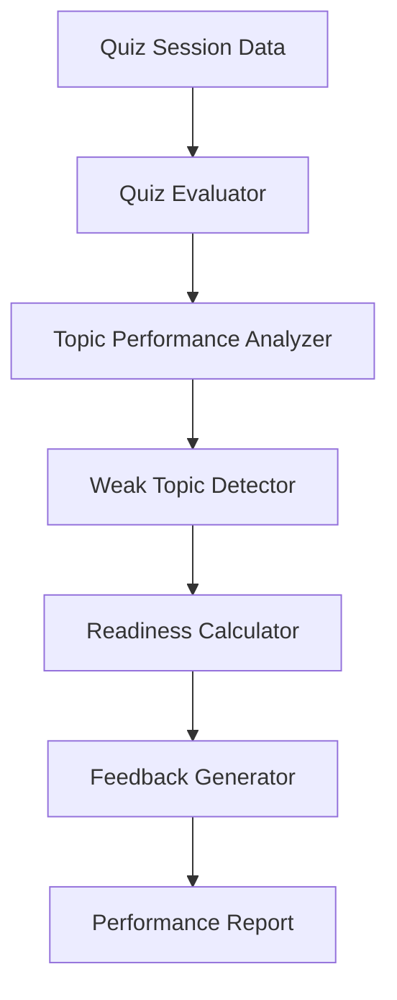

# Phase 5: Performance Analysis

> **Project:** StudyPilot AI
> **Phase:** 5 of N — Performance Analysis
> **Status:** Implementation-Ready
> **Author:** StudyPilot AI Development Team
> **Last Updated:** June 2025

---

## Table of Contents

1. [Objective](#objective)
2. [Features](#features)
3. [User Flow](#user-flow)
4. [Inputs](#inputs)
5. [Outputs](#outputs)
6. [Components](#components)
7. [Scoring Logic](#scoring-logic)
8. [Technical Architecture](#technical-architecture)
9. [API Design](#api-design)
10. [Data Structures](#data-structures)
11. [Libraries and Dependencies](#libraries-and-dependencies)
12. [Folder Structure](#folder-structure)
13. [Implementation Steps](#implementation-steps)
14. [Performance Optimization](#performance-optimization)
15. [Edge Cases](#edge-cases)
16. [Testing Checklist](#testing-checklist)
17. [Completion Criteria](#completion-criteria)

---

## Objective

Phase 5 analyzes the user's quiz performance after they submit answers in Phase 4. It calculates the score, accuracy percentage, topic-wise performance, strong topics, weak topics, and an exam readiness score.

This phase is important because it turns quiz results into useful feedback. Instead of only showing “8/10”, StudyPilot AI tells the student exactly which topics are strong and which topics need revision.

The output from this phase will be used by:

* Study Planner
* Topic Time Estimator
* Analytics Dashboard
* Study Predictor
* PDF Export System

---

## Features

### Quiz Score Calculator

Calculates total correct answers.

**Example:**

```text
Score: 8/10
Accuracy: 80%
```

**Requirements:**

* Compare selected answer with correct answer
* Count correct answers
* Count wrong answers
* Calculate percentage accuracy

---

### Topic-Wise Performance

Calculates accuracy for each topic.

**Example:**

```text
Joins: 90%
Transactions: 40%
Triggers: 30%
Views: 80%
```

**Requirements:**

* Group questions by topic
* Count correct/wrong answers per topic
* Calculate topic accuracy percentage

---

### Weak Topic Detector

Finds topics where the student performed poorly.

**Example:**

```text
Weak Topics:
- Triggers
- Transactions
```

**Rule:**

* Topic accuracy below 60% = weak topic

---

### Strong Topic Detector

Finds topics where the student performed well.

**Example:**

```text
Strong Topics:
- Joins
- Views
```

**Rule:**

* Topic accuracy 75% or above = strong topic

---

### Exam Readiness Score

Generates a single readiness percentage.

**Example:**

```text
Exam Readiness: 76%
```

Based on:

* Overall quiz accuracy
* Number of weak topics
* Topic coverage
* Difficulty level of questions

---

### Feedback Generator

Creates short personalized feedback.

**Example:**

```text
You are strong in Joins and Views, but you need more practice in Transactions and Triggers.
Focus on weak topics before attempting another quiz.
```

---

## User Flow

```text
1. User submits quiz in Phase 4
        │
2. Quiz session data is received
        │
3. System compares selected answers with correct answers
        │
4. Total score is calculated
        │
5. Overall accuracy is calculated
        │
6. Questions are grouped by topic
        │
7. Topic-wise performance is calculated
        │
8. Weak and strong topics are detected
        │
9. Exam readiness score is generated
        │
10. Feedback is displayed to the user
        │
11. Results are stored for dashboard, planner, predictor, and export
```

---

## Inputs

| Input              | Type         | Description                                  |
| ------------------ | ------------ | -------------------------------------------- |
| Quiz Questions     | `list[dict]` | MCQs generated in Phase 4                    |
| Correct Answers    | `dict`       | Correct answer for each question             |
| User Answers       | `dict`       | Answers selected by the user                 |
| Topic Mapping      | `dict`       | Maps every question to its topic             |
| Difficulty Mapping | `dict`       | Maps every question to Easy, Medium, or Hard |

---

## Outputs

| Output               | Type        | Description                            |
| -------------------- | ----------- | -------------------------------------- |
| Score                | `int`       | Number of correct answers              |
| Total Questions      | `int`       | Total quiz questions attempted         |
| Accuracy             | `float`     | Overall percentage score               |
| Topic Performance    | `dict`      | Topic-wise accuracy and question count |
| Weak Topics          | `list[str]` | Topics below performance threshold     |
| Strong Topics        | `list[str]` | Topics above strong threshold          |
| Exam Readiness Score | `float`     | Estimated readiness percentage         |
| Feedback             | `str`       | Personalized learning feedback         |

---

## Components

### Quiz Evaluator

**Suggested file:** `modules/evaluator.py`

Responsible for comparing user answers with correct answers.

**Responsibilities:**

* Calculate correct answers
* Calculate wrong answers
* Calculate accuracy percentage
* Return basic score object

---

### Topic Performance Analyzer

**Suggested file:** `modules/topic_performance.py`

Responsible for topic-wise grouping.

**Responsibilities:**

* Group questions by topic
* Count correct/wrong per topic
* Calculate topic accuracy
* Prepare data for weak topic detection

---

### Weak Topic Detector

**Suggested file:** `modules/weak_topics.py`

Responsible for identifying weak and strong topics.

**Responsibilities:**

* Detect weak topics below 60%
* Detect strong topics above 75%
* Return categorized topic lists

---

### Readiness Calculator

**Suggested file:** `modules/readiness.py`

Responsible for calculating exam readiness score.

**Responsibilities:**

* Use overall accuracy
* Penalize weak topics
* Reward topic coverage
* Adjust score based on difficulty

---

### Feedback Generator

**Suggested file:** `modules/feedback_generator.py`

Responsible for generating user-friendly feedback.

**Responsibilities:**

* Summarize performance
* Mention strong topics
* Mention weak topics
* Suggest next step

---

## Scoring Logic

### Overall Accuracy

```python
accuracy = (correct_answers / total_questions) * 100
```

---

### Topic Accuracy

```python
topic_accuracy = (topic_correct / topic_total) * 100
```

---

### Weak Topic Rule

```python
if topic_accuracy < 60:
    weak_topics.append(topic)
```

---

### Strong Topic Rule

```python
if topic_accuracy >= 75:
    strong_topics.append(topic)
```

---

### Exam Readiness Formula

Recommended MVP formula:

```python
readiness = accuracy - (len(weak_topics) * 5)
```

Clamp result between 0 and 100:

```python
readiness = max(0, min(100, readiness))
```

Better formula:

```python
readiness = (
    accuracy * 0.65 +
    topic_coverage_score * 0.20 +
    difficulty_score * 0.15
) - weak_topic_penalty
```

---

## Technical Architecture

```text
Quiz Session Data
        │
        ▼
Quiz Evaluator
        │
        ▼
Topic Performance Analyzer
        │
        ▼
Weak Topic Detector
        │
        ▼
Readiness Calculator
        │
        ▼
Feedback Generator
        │
        ▼
Performance Report
```

### Mermaid Diagram



---

## API Design

### `evaluate_quiz(quiz_session: dict) -> dict`

Evaluates total score.

```python
result = evaluate_quiz(quiz_session)
```

**Response:**

```json
{
  "score": 8,
  "total": 10,
  "accuracy": 80.0
}
```

---

### `analyze_topic_performance(quiz_session: dict) -> dict`

Calculates topic-wise performance.

```python
topic_result = analyze_topic_performance(quiz_session)
```

**Response:**

```json
{
  "Joins": {
    "correct": 3,
    "total": 3,
    "accuracy": 100
  },
  "Transactions": {
    "correct": 1,
    "total": 3,
    "accuracy": 33.33
  }
}
```

---

### `detect_weak_topics(topic_performance: dict) -> dict`

Detects weak and strong topics.

```python
topics = detect_weak_topics(topic_performance)
```

**Response:**

```json
{
  "weak_topics": ["Transactions", "Triggers"],
  "strong_topics": ["Joins", "Views"]
}
```

---

### `calculate_readiness(accuracy: float, weak_topics: list, topic_performance: dict) -> float`

Calculates readiness score.

```python
readiness = calculate_readiness(accuracy, weak_topics, topic_performance)
```

---

### `generate_feedback(report: dict) -> str`

Generates personalized feedback.

```python
feedback = generate_feedback(report)
```

---

## Data Structures

### Quiz Evaluation Result

```json
{
  "score": 8,
  "total_questions": 10,
  "wrong_answers": 2,
  "accuracy": 80.0
}
```

---

### Topic Performance Object

```json
{
  "Joins": {
    "correct": 4,
    "wrong": 1,
    "total": 5,
    "accuracy": 80.0
  },
  "Transactions": {
    "correct": 1,
    "wrong": 3,
    "total": 4,
    "accuracy": 25.0
  }
}
```

---

### Full Performance Report

```json
{
  "quiz_id": "quiz_001",
  "score": 8,
  "total_questions": 10,
  "accuracy": 80.0,
  "topic_performance": {
    "Joins": {
      "correct": 4,
      "wrong": 1,
      "total": 5,
      "accuracy": 80.0
    }
  },
  "weak_topics": ["Transactions", "Triggers"],
  "strong_topics": ["Joins", "Views"],
  "exam_readiness": 76.0,
  "feedback": "You are strong in Joins and Views, but need more practice in Transactions and Triggers."
}
```

---

## Libraries and Dependencies

| Library      | Purpose                                                   |
| ------------ | --------------------------------------------------------- |
| `streamlit`  | Display score, weak topics, readiness score, and feedback |
| `pandas`     | Store and process topic-wise performance data             |
| `matplotlib` | Display simple performance charts                         |
| `typing`     | Add type hints for function signatures                    |
| `statistics` | Optional calculations for average topic performance       |

---

## Folder Structure

```text
StudyPilotAI/
│
├── modules/
│   ├── evaluator.py
│   ├── topic_performance.py
│   ├── weak_topics.py
│   ├── readiness.py
│   └── feedback_generator.py
│
├── schemas/
│   └── performance_schema.py
│
├── tests/
│   └── test_phase5.py
│
└── phase5_pipeline.py
```

---

## Implementation Steps

1. Create `evaluator.py`.
2. Accept quiz session data from Phase 4.
3. Loop through every question.
4. Compare selected answer with correct answer.
5. Count correct answers.
6. Count wrong answers.
7. Calculate overall accuracy.
8. Create `topic_performance.py`.
9. Group questions by topic.
10. Count correct and wrong answers per topic.
11. Calculate topic-wise accuracy.
12. Create `weak_topics.py`.
13. Add weak topic threshold of 60%.
14. Add strong topic threshold of 75%.
15. Detect weak topics.
16. Detect strong topics.
17. Create `readiness.py`.
18. Implement MVP readiness formula.
19. Clamp readiness score between 0 and 100.
20. Create `feedback_generator.py`.
21. Generate personalized feedback text.
22. Create `phase5_pipeline.py`.
23. Combine all Phase 5 modules.
24. Display results in Streamlit.
25. Pass report to Phase 6, Phase 9, and Phase 10.

---

## Performance Optimization

* Use simple dictionary-based calculations instead of heavy processing.
* Avoid calling Groq API for basic scoring.
* Cache performance report in `st.session_state`.
* Store topic performance once and reuse it in dashboard.
* Use deterministic formulas for faster demo performance.
* Keep charts lightweight for Streamlit.

---

## Edge Cases

| Edge Case                    | Handling Strategy                                              |
| ---------------------------- | -------------------------------------------------------------- |
| No quiz submitted            | Show message: “Please complete a quiz first.”                  |
| Empty user answers           | Block evaluation                                               |
| Missing correct answer       | Mark question invalid and skip                                 |
| Missing topic                | Assign topic as `"General"`                                    |
| Division by zero             | Return accuracy as `0`                                         |
| User answers fewer questions | Evaluate only submitted answers or block incomplete submission |
| All answers wrong            | Accuracy becomes 0%, readiness clamped to 0                    |
| All answers correct          | Accuracy becomes 100%, readiness capped at 100                 |
| Topic has only one question  | Still calculate accuracy but mark confidence low               |

---

## Testing Checklist

* [ ] Correct answers are counted properly
* [ ] Wrong answers are counted properly
* [ ] Accuracy formula works
* [ ] Topic grouping works
* [ ] Topic accuracy works
* [ ] Weak topics are detected below 60%
* [ ] Strong topics are detected above 75%
* [ ] Readiness score is calculated
* [ ] Readiness score never goes below 0
* [ ] Readiness score never goes above 100
* [ ] Missing topic becomes General
* [ ] Empty quiz session is handled
* [ ] Empty user answers are handled
* [ ] Feedback text is generated
* [ ] Full report object is created
* [ ] Report is stored in session state
* [ ] Report is passed to study planner
* [ ] Report is passed to dashboard
* [ ] Charts display correctly
* [ ] Phase 5 works with Phase 4 output

---

## Completion Criteria

Phase 5 is complete when:

* [ ] Quiz score is calculated correctly
* [ ] Accuracy percentage is calculated correctly
* [ ] Topic-wise performance is generated
* [ ] Weak topics are detected
* [ ] Strong topics are detected
* [ ] Exam readiness score is generated
* [ ] Personalized feedback is displayed
* [ ] Performance report is stored
* [ ] Output is ready for planner, dashboard, predictor, and export
* [ ] Full flow from quiz submission to performance report works

---

*End of Phase 5: Performance Analysis Documentation*
*StudyPilot AI — Hackathon Development Build*
