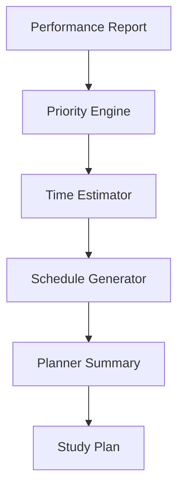

# Phase 6: Personalized Study Planner

> **Project:** StudyPilot AI
> **Phase:** 6 of N — Personalized Study Planner
> **Status:** Implementation-Ready
> **Author:** StudyPilot AI Development Team
> **Last Updated:** June 2025

---

## Table of Contents

1. [Objective](#objective)
2. [Features](#features)
3. [User Flow](#user-flow)
4. [Inputs](#inputs)
5. [Outputs](#outputs)
6. [Components](#components)
7. [Planning Logic](#planning-logic)
8. [Technical Architecture](#technical-architecture)
9. [API Design](#api-design)
10. [Data Structures](#data-structures)
11. [Libraries and Dependencies](#libraries-and-dependencies)
12. [Folder Structure](#folder-structure)
13. [Implementation Steps](#implementation-steps)
14. [Performance Optimization](#performance-optimization)
15. [Edge Cases](#edge-cases)
16. [Testing Checklist](#testing-checklist)
17. [Completion Criteria](#completion-criteria)

---

## Objective

Phase 6 generates a personalized study schedule based on the student's performance, available study time, and exam date.

The goal is to remove the burden of planning. Instead of manually deciding what to study each day, StudyPilot AI automatically creates an optimized revision plan focusing on weak topics while maintaining strong topics through periodic review.

This phase transforms performance data into actionable daily study tasks.

The output from this phase will be used by:

* Analytics Dashboard
* Study Predictor
* PDF Export System
* Revision System

---

## Features

### Exam Date Planning

Allows students to enter:

```text
Exam Date
```

Example:

```text
Current Date: June 10
Exam Date: June 20

Days Remaining: 10
```

**Requirements:**

* Calculate remaining study days
* Exclude past dates
* Validate date selection

---

### Daily Study Hours

Allows students to specify:

```text
Hours Per Day
```

Example:

```text
2 Hours Per Day
```

**Requirements:**

* Accept decimal values
* Minimum: 0.5 hours
* Maximum: 12 hours

---

### Topic Time Estimator

Estimates required study time for each topic.

Example:

```text
Joins            30 mins
Transactions     90 mins
Triggers         60 mins
Views            20 mins
```

Factors:

* Topic complexity
* Topic importance
* Weakness score
* Topic length

---

### Weak Topic Prioritization

Automatically prioritizes weak topics.

Example:

```text
Priority 1: Transactions
Priority 2: Triggers
Priority 3: Views
```

Rules:

* Weak topics appear first
* Strong topics appear later
* More time assigned to weak topics

---

### Daily Study Plan Generator

Creates a complete revision schedule.

Example:

```text
Day 1
Transactions (60 mins)
Triggers (60 mins)

Day 2
Transactions Practice (45 mins)
Views (30 mins)
Joins (45 mins)
```

---

### Revision Distribution

Distributes topics across available days.

Goals:

* Avoid studying everything on one day
* Balance workload
* Ensure all topics are covered before exam

---

### Planner Summary

Displays:

```text
Days Available: 10

Topics Covered: 8

Total Study Time: 18 Hours

Average Daily Time: 1.8 Hours
```

---

## User Flow

```text
1. User completes quiz
        │
2. Performance report received from Phase 5
        │
3. User enters exam date
        │
4. User enters daily study hours
        │
5. Topic time estimates calculated
        │
6. Weak topics prioritized
        │
7. Daily study schedule generated
        │
8. Revision plan distributed across days
        │
9. Planner summary generated
        │
10. Study plan displayed and stored
```

---

## Inputs

| Input             | Type         | Description                                |
| ----------------- | ------------ | ------------------------------------------ |
| Topic Performance | `dict`       | Performance report from Phase 5            |
| Weak Topics       | `list[str]`  | Weak topics identified in Phase 5          |
| Strong Topics     | `list[str]`  | Strong topics identified in Phase 5        |
| Topic Rankings    | `list[dict]` | Topic importance rankings from Phase 3     |
| Metadata          | `dict`       | Complexity and estimated study information |
| Exam Date         | `date`       | User-selected exam date                    |
| Hours Per Day     | `float`      | Daily available study time                 |

---

## Outputs

| Output               | Type         | Description                          |
| -------------------- | ------------ | ------------------------------------ |
| Topic Time Estimates | `dict`       | Estimated study time per topic       |
| Priority List        | `list[str]`  | Ordered list of topics by importance |
| Daily Study Plan     | `list[dict]` | Day-wise study schedule              |
| Planner Summary      | `dict`       | Overall planner statistics           |
| Total Study Hours    | `float`      | Total planned study time             |

---

## Components

### Study Planner Engine

**Suggested file:** `modules/study_planner.py`

Responsible for creating the study plan.

**Responsibilities:**

* Generate daily schedule
* Allocate topics
* Balance workload
* Create planner summary

---

### Topic Time Estimator

**Suggested file:** `modules/time_estimator.py`

Responsible for estimating study time.

**Responsibilities:**

* Analyze topic complexity
* Calculate study duration
* Increase time for weak topics

---

### Priority Engine

**Suggested file:** `modules/priority_engine.py`

Responsible for topic ordering.

**Responsibilities:**

* Prioritize weak topics
* Consider topic importance
* Generate revision order

---

### Schedule Generator

**Suggested file:** `modules/schedule_generator.py`

Responsible for creating day-wise plans.

**Responsibilities:**

* Split workload
* Assign tasks to days
* Respect daily hour limit

---

### Planner Summary Generator

**Suggested file:** `modules/planner_summary.py`

Responsible for statistics generation.

**Responsibilities:**

* Calculate total study hours
* Count topics covered
* Calculate average study time

---

## Planning Logic

### Days Remaining

```python
days_remaining = (exam_date - today).days
```

---

### Topic Priority Score

Example formula:

```python
priority_score =
(
    weakness_score * 0.5 +
    topic_importance * 0.3 +
    complexity_score * 0.2
)
```

Higher score = higher priority.

---

### Topic Time Estimate

Example:

```python
base_time = 30

if topic_is_weak:
    base_time += 30

if topic_complexity == "High":
    base_time += 30
```

---

### Daily Capacity

```python
daily_capacity =
hours_per_day * 60
```

Example:

```text
2 hours/day = 120 minutes/day
```

---

### Schedule Allocation

Pseudo logic:

```python
for topic in priority_topics:
    assign topic to earliest available day
```

---

## Technical Architecture

```text
Performance Report
        │
        ▼
Priority Engine
        │
        ▼
Time Estimator
        │
        ▼
Schedule Generator
        │
        ▼
Planner Summary Generator
        │
        ▼
Study Plan Output
```

### Mermaid Diagram



---

## API Design

### `estimate_topic_time(topic_data: dict) -> dict`

Estimates study time.

```python
time_estimates = estimate_topic_time(topics)
```

---

### `generate_priority_list(topic_data: dict) -> list`

Generates topic order.

```python
priority_topics = generate_priority_list(topics)
```

---

### `create_schedule(priority_topics: list, days: int, hours_per_day: float) -> list`

Creates study schedule.

```python
schedule = create_schedule(
    priority_topics,
    days=10,
    hours_per_day=2
)
```

---

### `generate_planner_summary(schedule: list) -> dict`

Generates planner statistics.

```python
summary = generate_planner_summary(schedule)
```

---

## Data Structures

### Topic Estimate

```json
{
  "topic": "Transactions",
  "complexity": "High",
  "importance": 0.92,
  "estimated_minutes": 90
}
```

---

### Daily Plan

```json
{
  "day": 1,
  "tasks": [
    {
      "topic": "Transactions",
      "duration": 60
    },
    {
      "topic": "Triggers",
      "duration": 60
    }
  ]
}
```

---

### Planner Summary

```json
{
  "days_available": 10,
  "topics_covered": 8,
  "total_study_hours": 18,
  "average_daily_hours": 1.8
}
```

---

### Full Study Plan

```json
{
  "priority_topics": [
    "Transactions",
    "Triggers",
    "Views"
  ],
  "daily_schedule": [],
  "summary": {}
}
```

---

## Libraries and Dependencies

| Library     | Purpose                        |
| ----------- | ------------------------------ |
| `streamlit` | Display study planner UI       |
| `datetime`  | Calculate remaining study days |
| `pandas`    | Store planner data             |
| `typing`    | Type hints                     |
| `math`      | Time calculations              |
| `json`      | Export planner data            |

---

## Folder Structure

```text
StudyPilotAI/
│
├── modules/
│   ├── study_planner.py
│   ├── time_estimator.py
│   ├── priority_engine.py
│   ├── schedule_generator.py
│   └── planner_summary.py
│
├── schemas/
│   └── planner_schema.py
│
├── tests/
│   └── test_phase6.py
│
└── phase6_pipeline.py
```

---

## Implementation Steps

1. Create `time_estimator.py`.
2. Load topic performance data.
3. Create topic complexity scoring.
4. Estimate time per topic.
5. Create `priority_engine.py`.
6. Calculate priority score.
7. Rank all topics.
8. Create `schedule_generator.py`.
9. Accept exam date.
10. Calculate remaining days.
11. Accept study hours per day.
12. Calculate daily capacity.
13. Distribute topics across days.
14. Ensure weak topics appear first.
15. Ensure no day exceeds time limit.
16. Create revision sessions.
17. Create `planner_summary.py`.
18. Generate summary statistics.
19. Create `study_planner.py`.
20. Combine all planner modules.
21. Display planner in Streamlit.
22. Save planner data.
23. Pass planner data to dashboard.
24. Pass planner data to predictor.
25. Pass planner data to PDF export.

---

## Performance Optimization

* Use deterministic calculations instead of AI calls.
* Cache generated plans.
* Recalculate only when exam date changes.
* Store planner in session state.
* Avoid regenerating schedule on page refresh.
* Use lightweight scheduling algorithm.

---

## Edge Cases

| Edge Case                          | Handling Strategy                 |
| ---------------------------------- | --------------------------------- |
| Exam date in past                  | Show validation error             |
| Exam today                         | Generate crash revision plan      |
| No weak topics                     | Use topic importance ranking      |
| Zero study hours                   | Prevent planner generation        |
| Extremely large syllabus           | Spread topics over available days |
| Very few days left                 | Generate intensive study schedule |
| Empty performance report           | Use topic rankings only           |
| Topic estimate exceeds daily limit | Split across multiple days        |

---

## Testing Checklist

* [ ] Exam date validation works
* [ ] Days remaining calculated correctly
* [ ] Topic estimates generated
* [ ] Priority ranking works
* [ ] Weak topics appear first
* [ ] Daily schedule generated
* [ ] No day exceeds daily limit
* [ ] Total study hours calculated
* [ ] Planner summary generated
* [ ] Planner stored successfully
* [ ] Empty data handled
* [ ] Zero-hour input handled
* [ ] Past date handled
* [ ] Topic splitting works
* [ ] Schedule displays correctly
* [ ] Streamlit UI works
* [ ] Planner updates when exam date changes
* [ ] Planner updates when hours change
* [ ] Dashboard integration works
* [ ] Export integration works

---

## Completion Criteria

Phase 6 is complete when:

* [ ] Exam date input works
* [ ] Study hours input works
* [ ] Topic time estimates generated
* [ ] Weak topics prioritized
* [ ] Daily schedule generated
* [ ] Workload distributed correctly
* [ ] Planner summary generated
* [ ] Planner displayed in Streamlit
* [ ] Planner saved successfully
* [ ] Output available for Dashboard, Predictor, and Export modules

---

*End of Phase 6: Personalized Study Planner Documentation*
*StudyPilot AI — Hackathon Development Build*
