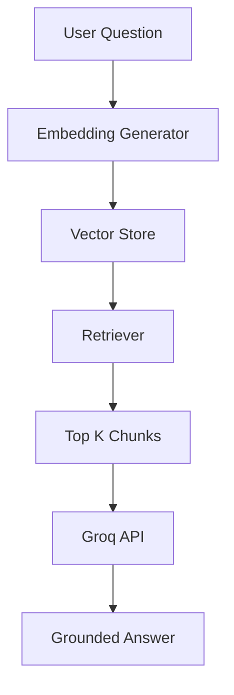

# Phase 7: AI Doubt Solver (Mini RAG System)

> **Project:** StudyPilot AI
> **Phase:** 7 of N — AI Doubt Solver (Mini RAG System)
> **Status:** Implementation-Ready
> **Author:** StudyPilot AI Development Team
> **Last Updated:** June 2025

---

## Table of Contents

1. [Objective](#objective)
2. [Features](#features)
3. [User Flow](#user-flow)
4. [Inputs](#inputs)
5. [Outputs](#outputs)
6. [Components](#components)
7. [RAG Logic](#rag-logic)
8. [Technical Architecture](#technical-architecture)
9. [API Design](#api-design)
10. [Data Structures](#data-structures)
11. [Libraries and Dependencies](#libraries-and-dependencies)
12. [Folder Structure](#folder-structure)
13. [Implementation Steps](#implementation-steps)
14. [Performance Optimization](#performance-optimization)
15. [Edge Cases](#edge-cases)
16. [Testing Checklist](#testing-checklist)
17. [Completion Criteria](#completion-criteria)

---

## Objective

Phase 7 introduces an AI-powered doubt-solving assistant that answers student questions using only the uploaded study material.

Unlike a normal chatbot, this system uses a lightweight Retrieval-Augmented Generation (RAG) pipeline. The assistant first searches relevant information from the uploaded notes, summaries, PDFs, and transcripts before generating an answer.

This ensures that responses remain grounded in the student's actual study content rather than relying on general model knowledge.

The objective is to create a personalized tutor that can explain concepts, answer questions, provide examples, and clarify doubts based on the student's uploaded material.

---

## Features

### Context-Aware Question Answering

Students can ask questions such as:

```text
Explain Transactions
```

```text
What is an Inner Join?
```

```text
Why are ACID properties important?
```

The system searches uploaded content before answering.

---

### Notes-Based Responses

All responses should come primarily from uploaded study material.

Example:

```text
Question:
What is a Trigger?

Answer:
According to your uploaded notes, a Trigger is a stored database program that automatically executes when a specified event occurs.
```

---

### Follow-Up Questions

Support conversational learning.

Example:

```text
User:
Explain Joins

User:
Give an example

User:
Explain Inner Join only
```

---

### Source References

Show the source section used.

Example:

```text
Answer generated from:

Chapter 4
Database Transactions
```

---

### Confidence Score

Generate confidence score.

Example:

```text
Confidence: 92%
```

Based on:

* Similarity score
* Amount of retrieved content
* Query coverage

---

### Fallback Response

If answer cannot be found:

```text
I could not find enough information in your uploaded notes to answer this question.
```

Avoid hallucinations.

---

## User Flow

```text
1. User uploads study material
        │
2. Content processed in Phase 2
        │
3. User opens AI Doubt Solver
        │
4. User enters question
        │
5. Question converted to embedding
        │
6. Relevant chunks retrieved
        │
7. Context sent to Groq API
        │
8. Grounded answer generated
        │
9. Source references displayed
        │
10. Conversation stored
```

---

## Inputs

| Input             | Type        | Description                  |
| ----------------- | ----------- | ---------------------------- |
| User Question     | `str`       | Question asked by student    |
| Raw Study Content | `str`       | Content from Phase 1         |
| Summaries         | `str`       | Generated summaries          |
| Topics            | `list`      | Extracted topics             |
| Concept Data      | `list`      | Extracted concepts           |
| Retrieved Chunks  | `list[str]` | Most relevant content chunks |

---

## Outputs

| Output            | Type    | Description                    |
| ----------------- | ------- | ------------------------------ |
| Answer            | `str`   | AI-generated response          |
| Retrieved Sources | `list`  | Context chunks used            |
| Confidence Score  | `float` | Confidence percentage          |
| Chat History      | `list`  | Previous conversation messages |

---

## Components

### Chunk Manager

**Suggested file:** `modules/chunk_manager.py`

Responsible for dividing content into chunks.

**Responsibilities:**

* Split notes into chunks
* Preserve context boundaries
* Generate chunk metadata

---

### Embedding Generator

**Suggested file:** `modules/embedding_generator.py`

Responsible for creating embeddings.

**Responsibilities:**

* Convert chunks to vectors
* Convert questions to vectors
* Store embeddings

---

### Vector Store

**Suggested file:** `modules/vector_store.py`

Responsible for retrieval.

**Responsibilities:**

* Store embeddings
* Search nearest neighbors
* Return top relevant chunks

---

### Retrieval Engine

**Suggested file:** `modules/retriever.py`

Responsible for retrieving context.

**Responsibilities:**

* Receive user query
* Search vector store
* Return top-k chunks

---

### RAG Generator

**Suggested file:** `modules/rag.py`

Responsible for answer generation.

**Responsibilities:**

* Build prompt
* Insert retrieved context
* Generate grounded response
* Prevent hallucination

---

### Chat Manager

**Suggested file:** `modules/chat_manager.py`

Responsible for conversation handling.

**Responsibilities:**

* Store history
* Manage follow-ups
* Maintain context window

---

## RAG Logic

### Step 1: Chunking

Example:

```text
Chunk 1:
Database Systems Introduction

Chunk 2:
Joins

Chunk 3:
Transactions

Chunk 4:
Triggers
```

Recommended:

```python
chunk_size = 500
chunk_overlap = 100
```

---

### Step 2: Embedding Creation

Convert every chunk into vector embeddings.

Example:

```python
embedding = embedding_model.encode(chunk)
```

---

### Step 3: Similarity Search

Search for most relevant chunks.

Example:

```python
top_k = 3
```

Retrieve:

```text
Chunk 2
Chunk 3
Chunk 4
```

---

### Step 4: Context Construction

Build prompt:

```text
Context:
{retrieved_chunks}

Question:
{user_question}
```

---

### Step 5: Answer Generation

Prompt:

```text
Answer ONLY using the provided context.

If answer is not present,
say you do not know.

Context:
{context}

Question:
{question}
```

---

## Technical Architecture

```text
User Question
        │
        ▼
Embedding Generator
        │
        ▼
Vector Store
        │
        ▼
Retriever
        │
        ▼
Top-K Chunks
        │
        ▼
Groq API
        │
        ▼
Grounded Answer
```

### Mermaid Diagram



---

## API Design

### `create_chunks(text: str) -> list`

Creates chunks.

```python
chunks = create_chunks(content)
```

---

### `generate_embeddings(chunks: list) -> list`

Creates embeddings.

```python
embeddings = generate_embeddings(chunks)
```

---

### `retrieve_context(question: str) -> list`

Retrieves relevant chunks.

```python
chunks = retrieve_context(question)
```

---

### `generate_answer(question: str, context: list) -> str`

Generates answer.

```python
answer = generate_answer(question, context)
```

---

### `calculate_confidence(similarity_scores: list) -> float`

Calculates confidence.

```python
confidence = calculate_confidence(scores)
```

---

## Data Structures

### Chunk Object

```json
{
  "chunk_id": 1,
  "content": "Transactions ensure data consistency...",
  "source": "Database Notes"
}
```

---

### Retrieved Context

```json
{
  "query": "Explain Transactions",
  "chunks": [
    {
      "chunk_id": 3,
      "similarity": 0.91
    }
  ]
}
```

---

### Chat Message

```json
{
  "role": "user",
  "content": "Explain Transactions"
}
```

---

### Full Response

```json
{
  "answer": "Transactions ensure data consistency...",
  "confidence": 91.2,
  "sources": [
    "Database Notes - Transactions"
  ]
}
```

---

## Libraries and Dependencies

| Library                 | Purpose                       |
| ----------------------- | ----------------------------- |
| `sentence-transformers` | Generate embeddings           |
| `faiss-cpu`             | Fast vector similarity search |
| `groq`                  | Generate grounded answers     |
| `numpy`                 | Vector operations             |
| `streamlit`             | Chat UI                       |
| `typing`                | Type hints                    |

---

## Folder Structure

```text
StudyPilotAI/
│
├── modules/
│   ├── chunk_manager.py
│   ├── embedding_generator.py
│   ├── vector_store.py
│   ├── retriever.py
│   ├── rag.py
│   └── chat_manager.py
│
├── vector_db/
│   └── embeddings.index
│
├── tests/
│   └── test_phase7.py
│
└── phase7_pipeline.py
```

---

## Implementation Steps

1. Create chunk manager.
2. Split content into chunks.
3. Create embedding generator.
4. Install sentence-transformers.
5. Generate chunk embeddings.
6. Create FAISS vector index.
7. Store embeddings.
8. Create retriever.
9. Implement similarity search.
10. Retrieve top-k chunks.
11. Create RAG prompt.
12. Create rag.py.
13. Send prompt to Groq.
14. Generate grounded answer.
15. Add source references.
16. Calculate confidence score.
17. Create chat manager.
18. Store conversation history.
19. Build Streamlit chat UI.
20. Test with uploaded notes.
21. Optimize retrieval quality.
22. Add fallback responses.
23. Integrate with previous phases.
24. Save vector database.
25. Complete end-to-end testing.

---

## Performance Optimization

* Generate embeddings only once.
* Cache FAISS index.
* Use top-k = 3 retrieval.
* Reuse vector database across sessions.
* Store embeddings locally.
* Limit chat history size.
* Compress large contexts before sending to Groq.

---

## Edge Cases

| Edge Case           | Handling Strategy                  |
| ------------------- | ---------------------------------- |
| Empty question      | Show validation error              |
| No uploaded content | Disable chatbot                    |
| No matching chunks  | Return fallback response           |
| FAISS index missing | Rebuild index                      |
| Groq API timeout    | Retry request                      |
| Very long question  | Truncate safely                    |
| Hallucination risk  | Force context-only answering       |
| Duplicate chunks    | Remove duplicates before retrieval |

---

## Testing Checklist

* [ ] Chunk creation works
* [ ] Embeddings generated correctly
* [ ] FAISS index created
* [ ] Similarity search works
* [ ] Top-k retrieval works
* [ ] Answer generated correctly
* [ ] Source references shown
* [ ] Confidence score calculated
* [ ] Empty question handled
* [ ] Missing content handled
* [ ] Chat history stored
* [ ] Follow-up questions work
* [ ] API failures handled
* [ ] No hallucinated answers
* [ ] End-to-end RAG pipeline works
* [ ] Streamlit chat UI works
* [ ] Response time under 5 seconds
* [ ] Vector database persists
* [ ] Context retrieval accurate
* [ ] Full integration tested

---

## Completion Criteria

Phase 7 is complete when:

* [ ] Student can ask questions
* [ ] Relevant chunks are retrieved
* [ ] Answers are generated from uploaded notes
* [ ] Source references displayed
* [ ] Confidence score generated
* [ ] Chat history maintained
* [ ] FAISS vector search operational
* [ ] Groq integration working
* [ ] Hallucinations minimized
* [ ] Full RAG workflow operational

---

*End of Phase 7: AI Doubt Solver Documentation*
*StudyPilot AI — Hackathon Development Build*
