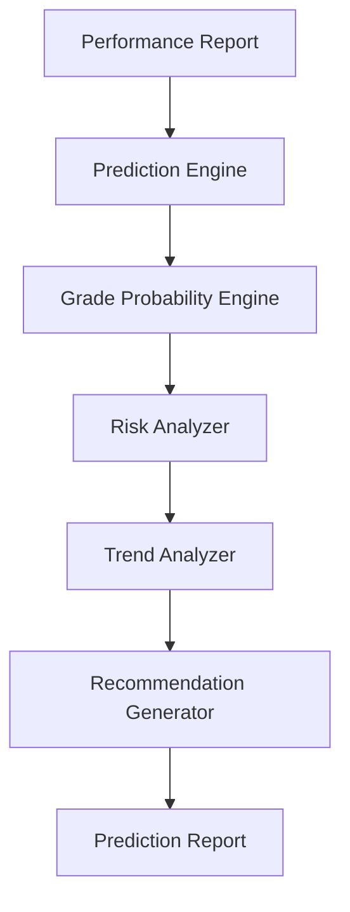

# Phase 8: Study Predictor

> **Project:** StudyPilot AI
> **Phase:** 8 of N — Study Predictor
> **Status:** Implementation-Ready
> **Author:** StudyPilot AI Development Team
> **Last Updated:** June 2025

---

## Table of Contents

1. [Objective](#objective)
2. [Features](#features)
3. [User Flow](#user-flow)
4. [Inputs](#inputs)
5. [Outputs](#outputs)
6. [Components](#components)
7. [Prediction Logic](#prediction-logic)
8. [Technical Architecture](#technical-architecture)
9. [API Design](#api-design)
10. [Data Structures](#data-structures)
11. [Libraries and Dependencies](#libraries-and-dependencies)
12. [Folder Structure](#folder-structure)
13. [Implementation Steps](#implementation-steps)
14. [Performance Optimization](#performance-optimization)
15. [Edge Cases](#edge-cases)
16. [Testing Checklist](#testing-checklist)
17. [Completion Criteria](#completion-criteria)

---

## Objective

Phase 8 introduces one of the most innovative features of StudyPilot AI: predicting a student's potential exam performance before the actual exam.

Using quiz results, weak topics, study planner data, topic coverage, and available study time, the system estimates:

* Predicted Exam Score
* Improvement Potential
* Probability of A Grade
* Readiness Trend
* Study Risk Level

Unlike traditional study tools, this feature provides students with actionable predictions that help them understand whether they are on track to achieve their academic goals.

This phase is designed to be a major hackathon showcase feature because it combines analytics, AI-assisted reasoning, and personalized educational insights.

---

## Features

### Predicted Exam Score

Predicts expected exam score range.

Example:

```text
Current Quiz Score: 65%

Predicted Exam Score:
80–88%
```

---

### Grade Probability

Predicts likelihood of achieving a target grade.

Example:

```text
Probability of A Grade:
72%
```

Possible grades:

```text
A
B
C
D
```

---

### Improvement Potential

Calculates possible improvement before exam.

Example:

```text
Current Performance:
65%

Expected Performance:
84%

Improvement:
+19%
```

---

### Readiness Trend

Shows current study trajectory.

Examples:

```text
Improving
Stable
Declining
```

---

### Study Risk Indicator

Identifies exam risk.

Examples:

```text
Low Risk
Medium Risk
High Risk
```

Based on:

* Weak topics
* Days remaining
* Study hours available
* Current readiness

---

### Recommendation Generator

Provides personalized recommendations.

Example:

```text
Increase daily study time from 2 hours to 3 hours to improve predicted score by approximately 6%.
```

---

## User Flow

```text
1. User completes quiz
        │
2. Performance report received
        │
3. Study planner generated
        │
4. Predictor receives performance data
        │
5. Improvement model calculates potential growth
        │
6. Predicted score generated
        │
7. Grade probability calculated
        │
8. Risk level assigned
        │
9. Recommendations generated
        │
10. Prediction report displayed
```

---

## Inputs

| Input          | Type        | Description                  |
| -------------- | ----------- | ---------------------------- |
| Quiz Accuracy  | `float`     | Current quiz score           |
| Exam Readiness | `float`     | Readiness score from Phase 5 |
| Weak Topics    | `list[str]` | Weak topic list              |
| Strong Topics  | `list[str]` | Strong topic list            |
| Days Remaining | `int`       | Days before exam             |
| Hours Per Day  | `float`     | Daily study hours            |
| Topic Coverage | `float`     | Percentage syllabus coverage |
| Study Plan     | `dict`      | Generated study schedule     |

---

## Outputs

| Output               | Type        | Description                  |
| -------------------- | ----------- | ---------------------------- |
| Predicted Score      | `dict`      | Expected score range         |
| Grade Probability    | `dict`      | Grade likelihood percentages |
| Improvement Estimate | `float`     | Expected score increase      |
| Risk Level           | `str`       | Low, Medium, High            |
| Trend                | `str`       | Improving, Stable, Declining |
| Recommendations      | `list[str]` | Personalized suggestions     |

---

## Components

### Prediction Engine

**Suggested file:** `modules/predictor.py`

Responsible for calculating exam score predictions.

**Responsibilities:**

* Calculate expected score
* Generate score range
* Estimate improvement

---

### Grade Probability Engine

**Suggested file:** `modules/grade_probability.py`

Responsible for grade estimation.

**Responsibilities:**

* Calculate grade likelihood
* Generate probabilities
* Normalize percentages

---

### Risk Analyzer

**Suggested file:** `modules/risk_analyzer.py`

Responsible for risk detection.

**Responsibilities:**

* Evaluate readiness
* Evaluate weak topics
* Determine risk level

---

### Trend Analyzer

**Suggested file:** `modules/trend_analyzer.py`

Responsible for trend detection.

**Responsibilities:**

* Analyze improvement patterns
* Detect performance trajectory

---

### Recommendation Generator

**Suggested file:** `modules/prediction_recommendations.py`

Responsible for personalized advice.

**Responsibilities:**

* Generate actionable suggestions
* Recommend study improvements

---

## Prediction Logic

### Predicted Score Formula

Basic MVP:

```python
predicted_score =
(
    quiz_accuracy * 0.5 +
    readiness_score * 0.3 +
    topic_coverage * 0.2
)
```

---

### Improvement Factor

```python
improvement_factor =
(
    days_remaining * 0.5 +
    hours_per_day * 2
)
```

---

### Final Prediction

```python
predicted_score += improvement_factor
```

Clamp:

```python
predicted_score =
max(0, min(100, predicted_score))
```

---

### Grade Probability

Example:

```python
if predicted_score >= 85:
    grade = "A"

elif predicted_score >= 70:
    grade = "B"

elif predicted_score >= 60:
    grade = "C"

else:
    grade = "D"
```

---

### Risk Analysis

```python
if readiness > 80:
    risk = "Low"

elif readiness > 60:
    risk = "Medium"

else:
    risk = "High"
```

---

## Technical Architecture

```text
Performance Report
        │
        ▼
Prediction Engine
        │
        ▼
Grade Probability Engine
        │
        ▼
Risk Analyzer
        │
        ▼
Trend Analyzer
        │
        ▼
Recommendation Generator
        │
        ▼
Prediction Report
```

### Mermaid Diagram



---

## API Design

### `predict_exam_score(data: dict) -> dict`

Predicts exam performance.

```python
prediction = predict_exam_score(student_data)
```

---

### `calculate_grade_probability(score: float) -> dict`

Calculates grade chances.

```python
grades = calculate_grade_probability(82)
```

Response:

```json
{
  "A": 72,
  "B": 20,
  "C": 6,
  "D": 2
}
```

---

### `calculate_risk(data: dict) -> str`

Calculates study risk.

```python
risk = calculate_risk(student_data)
```

---

### `generate_recommendations(data: dict) -> list`

Generates suggestions.

```python
recommendations =
generate_recommendations(student_data)
```

---

## Data Structures

### Prediction Report

```json
{
  "predicted_score": {
    "min": 80,
    "max": 88
  },
  "expected_score": 84,
  "improvement": 19,
  "risk_level": "Medium",
  "trend": "Improving"
}
```

---

### Grade Probabilities

```json
{
  "A": 72,
  "B": 20,
  "C": 6,
  "D": 2
}
```

---

### Recommendations

```json
[
  "Increase study time by 1 hour daily",
  "Focus on Transactions",
  "Retake quizzes after revision"
]
```

---

### Full Prediction Output

```json
{
  "predicted_score": {
    "min": 80,
    "max": 88
  },
  "grade_probability": {
    "A": 72,
    "B": 20,
    "C": 6,
    "D": 2
  },
  "improvement": 19,
  "risk_level": "Medium",
  "trend": "Improving",
  "recommendations": [
    "Increase study time by 1 hour daily"
  ]
}
```

---

## Libraries and Dependencies

| Library      | Purpose                      |
| ------------ | ---------------------------- |
| `pandas`     | Data processing              |
| `numpy`      | Numerical calculations       |
| `streamlit`  | Display prediction dashboard |
| `typing`     | Type hints                   |
| `statistics` | Average calculations         |
| `json`       | Export prediction report     |

---

## Folder Structure

```text
StudyPilotAI/
│
├── modules/
│   ├── predictor.py
│   ├── grade_probability.py
│   ├── risk_analyzer.py
│   ├── trend_analyzer.py
│   └── prediction_recommendations.py
│
├── schemas/
│   └── predictor_schema.py
│
├── tests/
│   └── test_phase8.py
│
└── phase8_pipeline.py
```

---

## Implementation Steps

1. Create predictor.py.
2. Load performance report.
3. Load planner data.
4. Calculate topic coverage.
5. Build prediction formula.
6. Calculate expected score.
7. Generate score range.
8. Create grade_probability.py.
9. Calculate grade chances.
10. Create risk_analyzer.py.
11. Evaluate readiness.
12. Evaluate weak topics.
13. Assign risk level.
14. Create trend_analyzer.py.
15. Analyze improvement trajectory.
16. Create recommendation engine.
17. Generate suggestions.
18. Build prediction report.
19. Display results in Streamlit.
20. Store report for dashboard/export.

---

## Performance Optimization

* Use deterministic calculations.
* Avoid additional LLM calls.
* Cache prediction reports.
* Recompute only when quiz or planner changes.
* Store outputs in session state.
* Keep prediction logic lightweight.

---

## Edge Cases

| Edge Case              | Handling Strategy               |
| ---------------------- | ------------------------------- |
| No quiz completed      | Disable predictor               |
| No planner generated   | Use default assumptions         |
| Exam tomorrow          | Generate urgent recommendations |
| Readiness = 0          | High risk                       |
| Predicted score > 100  | Clamp to 100                    |
| Predicted score < 0    | Clamp to 0                      |
| Missing topic coverage | Estimate from planner           |

---

## Testing Checklist

* [ ] Prediction generated successfully
* [ ] Grade probabilities sum to 100
* [ ] Risk analysis works
* [ ] Trend analysis works
* [ ] Improvement estimate works
* [ ] Recommendation generation works
* [ ] Score clamping works
* [ ] Empty data handled
* [ ] Dashboard integration works
* [ ] Planner integration works
* [ ] Export integration works
* [ ] UI displays correctly
* [ ] Report stored successfully
* [ ] Formula outputs validated
* [ ] Full Phase 8 pipeline tested

---

## Completion Criteria

Phase 8 is complete when:

* [ ] Predicted exam score generated
* [ ] Grade probability generated
* [ ] Risk level assigned
* [ ] Trend identified
* [ ] Improvement estimate calculated
* [ ] Recommendations generated
* [ ] Dashboard integration works
* [ ] Export integration works
* [ ] Streamlit UI functional
* [ ] Full prediction pipeline operational

---

*End of Phase 8: Study Predictor Documentation*
*StudyPilot AI — Hackathon Development Build*
