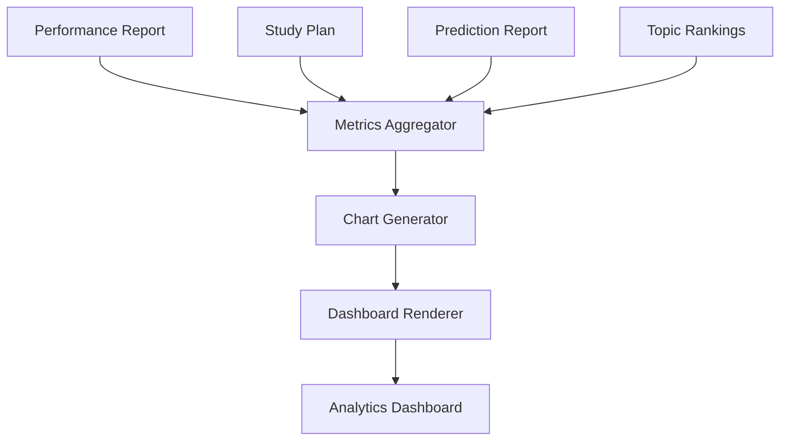

# Phase 9: Analytics Dashboard

> **Project:** StudyPilot AI
> **Phase:** 9 of N — Analytics Dashboard
> **Status:** Implementation-Ready
> **Author:** StudyPilot AI Development Team
> **Last Updated:** June 2025

---

## Table of Contents

1. [Objective](#objective)
2. [Features](#features)
3. [User Flow](#user-flow)
4. [Inputs](#inputs)
5. [Outputs](#outputs)
6. [Components](#components)
7. [Dashboard Metrics](#dashboard-metrics)
8. [Technical Architecture](#technical-architecture)
9. [API Design](#api-design)
10. [Data Structures](#data-structures)
11. [Libraries and Dependencies](#libraries-and-dependencies)
12. [Folder Structure](#folder-structure)
13. [Implementation Steps](#implementation-steps)
14. [Performance Optimization](#performance-optimization)
15. [Edge Cases](#edge-cases)
16. [Testing Checklist](#testing-checklist)
17. [Completion Criteria](#completion-criteria)

---

## Objective

Phase 9 provides a centralized analytics dashboard where students can visually monitor their learning progress, strengths, weaknesses, readiness level, study plan status, and predicted performance.

The dashboard transforms raw numbers into meaningful visual insights. Instead of reading multiple reports across different modules, students can access all important metrics from a single location.

This phase serves as the project's primary visualization and demonstration module, making it one of the most impressive features during the hackathon presentation.

The dashboard integrates outputs from:

* Phase 2: AI Processing Engine
* Phase 3: Learning Tools
* Phase 5: Performance Analysis
* Phase 6: Study Planner
* Phase 8: Study Predictor

---

## Features

### Overview Cards

Display important metrics at the top.

Example:

```text
Exam Readiness: 76%

Quiz Accuracy: 80%

Predicted Exam Score: 84%

Weak Topics: 2
```

---

### Topic Distribution Chart

Visualize topic importance.

Example:

```text
Joins           ██████████
Transactions    ████████
Views           ██████
Triggers        █████
```

Purpose:

* Show topic coverage
* Show content distribution

---

### Topic Performance Chart

Display topic-wise quiz performance.

Example:

```text
Joins           90%
Views           85%
Transactions    40%
Triggers        30%
```

Purpose:

* Identify weak areas quickly
* Visualize strengths and weaknesses

---

### Weak Topic Analysis

Display weak topics.

Example:

```text
Weak Topics

❌ Transactions
❌ Triggers
```

Purpose:

* Highlight improvement areas

---

### Exam Readiness Gauge

Display readiness score.

Example:

```text
Readiness: 76%
```

Visual:

```text
0 ----- 50 ----- 100
          ▲
         76
```

---

### Predicted Performance Panel

Display:

```text
Predicted Score:
80–88%

Expected:
84%

Grade Probability:
A = 72%
```

---

### Study Plan Summary

Display:

```text
Days Remaining: 10

Study Hours Planned: 18

Topics Covered: 8
```

---

### Progress Tracker

Track study completion.

Example:

```text
Study Progress

Completed:
70%

Remaining:
30%
```

---

## User Flow

```text
1. User uploads study material
        │
2. Quiz completed
        │
3. Performance report generated
        │
4. Study plan generated
        │
5. Prediction report generated
        │
6. Dashboard loads all reports
        │
7. Metrics visualized
        │
8. User monitors progress
```

---

## Inputs

| Input              | Type    | Description           |
| ------------------ | ------- | --------------------- |
| Topic Rankings     | `list`  | Topic importance data |
| Performance Report | `dict`  | Quiz analysis results |
| Weak Topics        | `list`  | Weak topics           |
| Strong Topics      | `list`  | Strong topics         |
| Study Plan         | `dict`  | Planner output        |
| Prediction Report  | `dict`  | Predictor output      |
| Readiness Score    | `float` | Readiness percentage  |

---

## Outputs

| Output                   | Type    | Description           |
| ------------------------ | ------- | --------------------- |
| Dashboard Metrics        | `dict`  | Aggregated statistics |
| Charts                   | `list`  | Visualization objects |
| Progress Summary         | `dict`  | Learning progress     |
| Readiness Visualization  | `chart` | Readiness gauge       |
| Prediction Visualization | `chart` | Predicted performance |

---

## Components

### Dashboard Manager

**Suggested file:** `modules/dashboard.py`

Responsible for coordinating all dashboard components.

**Responsibilities:**

* Load all reports
* Aggregate metrics
* Render dashboard sections

---

### Metrics Aggregator

**Suggested file:** `modules/metrics_aggregator.py`

Responsible for collecting metrics.

**Responsibilities:**

* Combine outputs from all phases
* Calculate summary statistics
* Prepare chart data

---

### Chart Generator

**Suggested file:** `modules/chart_generator.py`

Responsible for creating visualizations.

**Responsibilities:**

* Generate bar charts
* Generate pie charts
* Generate readiness gauge
* Generate progress charts

---

### Progress Tracker

**Suggested file:** `modules/progress_tracker.py`

Responsible for monitoring completion.

**Responsibilities:**

* Track completed topics
* Calculate progress
* Estimate remaining workload

---

### Dashboard Renderer

**Suggested file:** `modules/dashboard_renderer.py`

Responsible for Streamlit display.

**Responsibilities:**

* Render cards
* Render charts
* Organize layout

---

## Dashboard Metrics

### Core Metrics

```python
quiz_accuracy
exam_readiness
predicted_score
weak_topic_count
strong_topic_count
```

---

### Study Metrics

```python
days_remaining
total_study_hours
topics_covered
topics_remaining
```

---

### Prediction Metrics

```python
expected_score
grade_probability
risk_level
trend
```

---

### Progress Metrics

```python
completed_topics
remaining_topics
completion_percentage
```

---

## Technical Architecture

```text
Phase Reports
        │
        ▼
Metrics Aggregator
        │
        ▼
Chart Generator
        │
        ▼
Dashboard Renderer
        │
        ▼
Analytics Dashboard
```

### Mermaid Diagram



---

## API Design

### `aggregate_metrics(data: dict) -> dict`

Combines metrics.

```python
metrics = aggregate_metrics(all_reports)
```

---

### `generate_topic_chart(data: dict)`

Generates topic chart.

```python
chart = generate_topic_chart(topic_data)
```

---

### `generate_readiness_gauge(score: float)`

Generates readiness visualization.

```python
gauge = generate_readiness_gauge(76)
```

---

### `calculate_progress(plan: dict) -> dict`

Calculates study progress.

```python
progress = calculate_progress(study_plan)
```

---

## Data Structures

### Dashboard Metrics

```json
{
  "quiz_accuracy": 80,
  "exam_readiness": 76,
  "predicted_score": 84,
  "weak_topics": 2
}
```

---

### Topic Performance

```json
{
  "Joins": 90,
  "Views": 85,
  "Transactions": 40,
  "Triggers": 30
}
```

---

### Progress Report

```json
{
  "completed_topics": 7,
  "remaining_topics": 3,
  "completion_percentage": 70
}
```

---

### Prediction Summary

```json
{
  "expected_score": 84,
  "risk_level": "Medium",
  "grade_probability": {
    "A": 72,
    "B": 20,
    "C": 6,
    "D": 2
  }
}
```

---

## Libraries and Dependencies

| Library      | Purpose               |
| ------------ | --------------------- |
| `streamlit`  | Dashboard UI          |
| `plotly`     | Interactive charts    |
| `matplotlib` | Static visualizations |
| `pandas`     | Data processing       |
| `numpy`      | Numerical operations  |
| `json`       | Data handling         |

---

## Folder Structure

```text
StudyPilotAI/
│
├── modules/
│   ├── dashboard.py
│   ├── metrics_aggregator.py
│   ├── chart_generator.py
│   ├── progress_tracker.py
│   └── dashboard_renderer.py
│
├── tests/
│   └── test_phase9.py
│
└── phase9_pipeline.py
```

---

## Implementation Steps

1. Create dashboard.py.
2. Load reports from previous phases.
3. Create metrics_aggregator.py.
4. Aggregate all metrics.
5. Create chart_generator.py.
6. Generate topic distribution chart.
7. Generate topic performance chart.
8. Generate readiness gauge.
9. Generate study progress chart.
10. Create progress_tracker.py.
11. Calculate completion metrics.
12. Create dashboard_renderer.py.
13. Design Streamlit layout.
14. Add metric cards.
15. Add charts.
16. Add readiness section.
17. Add prediction section.
18. Add planner section.
19. Test responsiveness.
20. Complete integration testing.

---

## Performance Optimization

* Cache chart data.
* Avoid recalculating metrics repeatedly.
* Use Plotly for lightweight rendering.
* Store dashboard metrics in session state.
* Load charts lazily when needed.
* Reuse performance reports from previous phases.

---

## Edge Cases

| Edge Case               | Handling Strategy       |
| ----------------------- | ----------------------- |
| No quiz completed       | Hide performance charts |
| No planner available    | Hide planner section    |
| No prediction report    | Hide predictor panel    |
| Empty topic data        | Show placeholder chart  |
| Missing readiness score | Default to 0            |
| No weak topics          | Show success state      |
| Large dataset           | Paginate charts         |

---

## Testing Checklist

* [ ] Dashboard loads correctly
* [ ] Metrics displayed correctly
* [ ] Topic chart renders
* [ ] Performance chart renders
* [ ] Readiness gauge renders
* [ ] Prediction panel renders
* [ ] Planner summary renders
* [ ] Progress tracker works
* [ ] Empty data handled
* [ ] Missing reports handled
* [ ] Charts update dynamically
* [ ] Streamlit layout responsive
* [ ] Plotly charts interactive
* [ ] Session state works
* [ ] Full integration tested

---

## Completion Criteria

Phase 9 is complete when:

* [ ] Dashboard loads successfully
* [ ] Metrics displayed correctly
* [ ] Topic charts generated
* [ ] Weak topic analysis displayed
* [ ] Readiness gauge functional
* [ ] Prediction panel functional
* [ ] Study planner summary displayed
* [ ] Progress tracking works
* [ ] Dashboard integrates all previous phases
* [ ] Streamlit UI fully operational

---

*End of Phase 9: Analytics Dashboard Documentation*
*StudyPilot AI — Hackathon Development Build*
